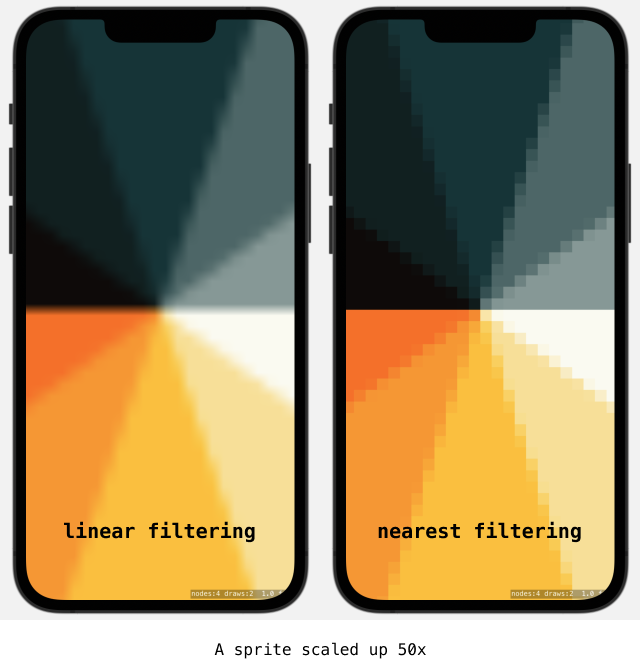
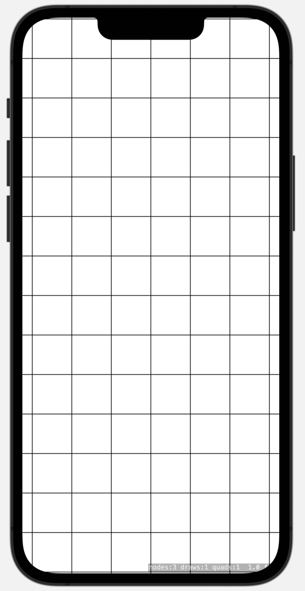
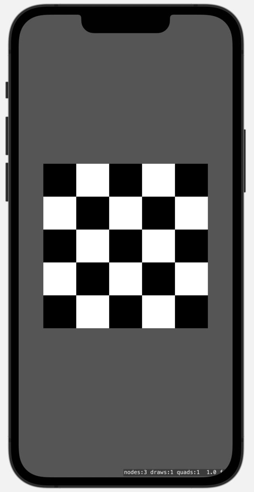
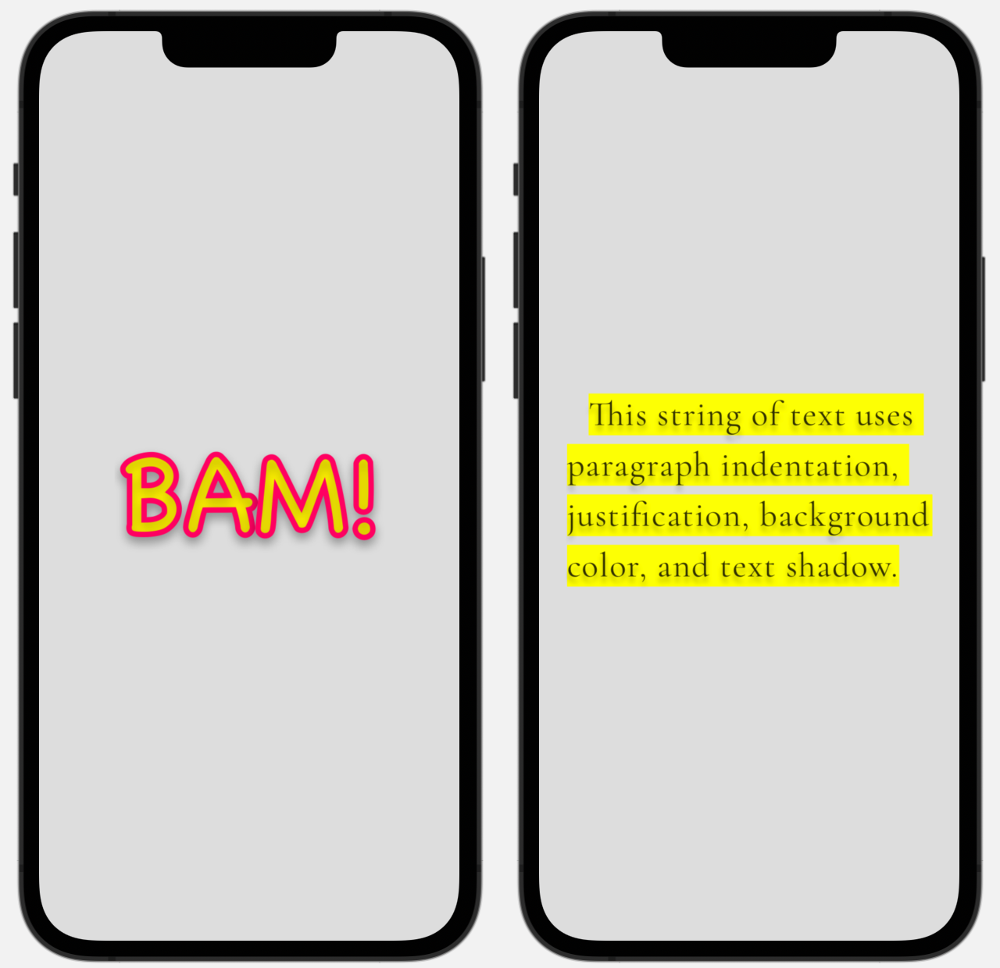

# Learning SpriteKit

## Timing Function

*8 July 2025*

The pace of a standard action such as `SKAction.move(to:duration:)` can be changed using the `timingFunction` property:

```swift
let action = SKAction.move(to: targetPosition, duration: 1)

/// Bounce effect
action.timingFunction = { time in
    if time < 1/2.75 {
    	return 7.5625 * time * time
    } else if time < 2/2.75 {
	    let t2 = time - 1.5/2.75
    	return 7.5625 * t2 * t2 + 0.75
    } else if time < 2.5/2.75 {
	    let t2 = time - 2.25/2.75
    	return 7.5625 * t2 * t2 + 0.9375
    } else {
	    let t2 = time - 2.625/2.75
    	return 7.5625 * t2 * t2 + 0.984375
    }
}
```

The custom timing function will make the node bounce against the target position a few times before settling in. However, it seems that a timing function cannot make a standard action overshoot the start or target position of a node. For example, this timing function:

```swift
static let easeOutElastic: (Float) -> Float = { time in
	// Period controls how many wiggles (oscillations) the elastic effect does
    let period: Float = (2 * .pi) / 3

    if time == 0 {
        return 0
    }
                                               
    if time == 1 {
        return 1
    }

    let exponent = pow(2, -10 * time)
    let sineComponent = sin((time * 10 - 0.75) * period)
    let elasticValue = exponent * sineComponent + 1

    return elasticValue
}
```

... should produce an elastic spring effect. However, running the action doesn't produce any such result.

In order to create an elastic behavior, a custom action is required. For example:

```swift
/// `Period` controls how much the animation wiggles before settling.
/// Lower values like 0.2 mean more oscillation.
/// Higher values like 0.5 mean less oscillation.
/// Typical range: 0.2...0.8. Default is 0.3.
func animatePositionWithSpring(_ node: SKNode, targetPosition: CGPoint, duration: TimeInterval, period: CGFloat = 0.3) {
    let startPosition = node.position
    let endPosition = targetPosition

    let action = SKAction.customAction(withDuration: duration) { node, elapsedTime in
        let normalizedTime = max(0, min(1, CGFloat(elapsedTime) / CGFloat(duration)))

        if normalizedTime == 0 {
            node.position = startPosition
        } else if normalizedTime == 1 {
            node.position = endPosition
        } else {
            let overshoot = period / 4
            let elasticValue = pow(2, -10 * normalizedTime) * sin((normalizedTime - overshoot) * (2 * .pi) / period) + 1
            let interpolatedX = startPosition.x + (endPosition.x - startPosition.x) * elasticValue
            let interpolatedY = startPosition.y + (endPosition.y - startPosition.y) * elasticValue
            node.position = CGPoint(x: interpolatedX, y: interpolatedY)
        }
    }

    let actionKey = "TransformSystemActionWithSpring-Position"
    node.removeAction(forKey: actionKey)
    node.run(action, withKey: actionKey)
}
```

## Notes on UIKit-SwiftUI with SpriteKit

*22 May 2025*

In the context of highly interactive programs, like games and simulations, UI frameworks are a handicap.

UI frameworks are ready-made building blocks designed for programs where views are mostly static. Change happens when users request specific data.

Both SwiftUI and UIKit come with a set of highly opinionated building blocks that you just have to accept and learn.

SwiftUI is marketed as easier than UIKit. In my experience, that hasn't been the case. SwiftUI relies on advanced patterns of the Swift programming language. Many quirks and idioms of SwiftUI were incomprehensible to me until I got more familiar with Swift, often years later. For example, consider the many ways you can write a VStack:
```swift
VStack {

}

VStack() {

}

VStack(spacing: 10) {

}

VStack(spacing: 10, content: {

})
```

When I started learning Swift and SwiftUI at the same time, I had no idea what to write. The logic of the syntax was inscrutable to me. I couldn't guess what should come next: why braces? Why parentheses? Which argument to use? How to find the name for "border width" or "font weight"? Where to put them?

After some considerable time with Swift, the VStack writing above started to make sense within the context of Swift:

```swift
// VStack is a function name

VStack {
    // In Swift, we can write `function {}` if the last argument of the function
    // takes a closure, i.e. some code to run.
    // We can omit the `()` for calling the function.
}

VStack() {
    // We could call VStack like any other function using (). But we still need
    // to pass a trailing closure {} because that closure is a required parameter.
}

VStack(spacing: 10) {
    // The function VStack has optional parameters, which we can put inside the `()`
}

VStack(spacing: 10, content: {
    // This time we explicitly name the closure parameter, `content`, give it
    // a closure, then close the parenthesis.
    // In Swift, if the last parameter of a function is a closure, we can omit
    // the name of the parameter, and pass the closure after the `()`
})
```

SwiftUI syntax is only understandable if you already got Swift's function, closure, and trailing closure rules. Otherwise, it's inscrutable.

UIKit has a more classical dot chaining and line after line of property setters. If you come from a C-inspired framework or language, UIKit feels closer to home. But it has its own quirks. For example, UIKit relies heavily on the delegate pattern. Many building blocks, such as a list or a collection view, come with a conformance protocol that you add to your view controller, then you add those conformance functions inside your class, and then you get magic behavior. There isn't a way to guess these functions, you just have to know them.

For basic setups, SwiftUI gets you there quicker than UIKit. Setting up your app entry points is easier with SwiftUI. But about 100% of the time, you'll eventually use UIKit or AppKit anyways, because some specific behavior requires that you access a system-wide property that is only exposed with imperative code. For example: what is the current refresh rate of the device? What is the current orientation? What is the current retina scale?

SpriteKit was made in the UIKit era. SpriteKit uses multiple patterns that UIKit does, such as delegates. SpriteKit handles user input using methods that are in fact UIKit and AppKit methods, such as touchesBegan and pressesBegan. In many ways, SpriteKit is closer to UIKit than to SwiftUI. I use UIKit with SpriteKit, because the context switch is less jarring than switching to SwiftUI.

Personally, I'd rather not use any UI framework at all, and just live in a 2D or 3D world with a scene graph, a physics engine, and an explicit update loop.

## Touch Events Timing

*8 May 2025*

When are touch events delivered relative to SpriteKit’s update loop? Can they happen mid-frame, between `update` and `didSimulatePhysics`? If there's post-processing in `didFinishUpdate` that modifies the whole tree, which node would be picked up but hit detection calculations such as `nodes(at:)`?

We can diagnose that with the following setup:

```swift
class MyScene: SKScene {
    var start = CFAbsoluteTimeGetCurrent()

    override func update(_ currentTime: TimeInterval) {
        start = CFAbsoluteTimeGetCurrent()
        print("🟢 Frame Start: \(start)")
    }

    override func didFinishUpdate() {
        let now = CFAbsoluteTimeGetCurrent()
        print("🔴 Frame End: \(now)")
    }

    override func touchesBegan(_ touches: Set<UITouch>, with event: UIEvent?) {
        let now = CFAbsoluteTimeGetCurrent()
        print("🟡 touchesBegan at \(now)")
    }

}
```

This will print something like:

```swift
🟡 touchesBegan at 768395873.87242
🟢 Frame Start: 768395873.885066
🔴 Frame End: 768395873.885171
🟢 Frame Start: 768395873.901704
//..
🟢 Frame Start: 768395874.501757
🔴 Frame End: 768395874.502179
🟡 touchesBegan at 768395874.519156
🟢 Frame Start: 768395874.519402
🔴 Frame End: 768395874.52009
//..
🟢 Frame Start: 768395874.785056
🔴 Frame End: 768395874.785298
🟡 touchesBegan at 768395874.802803
🟢 Frame Start: 768395874.80304
🔴 Frame End: 768395874.803363
```

If you continue logging, you'll notice that the touches began event is always fired *after* a frame end and *before* a frame start.

This means that the code called by the touch callback runs before any code called by the `update` function of SpriteKit. You can assume that touch events are captured while the frame render is on screen, i.e. after `didFinishUpdate` of the current frame and before the `update` of the next frame.

## The Reciprocity of Contact Detection

*1 April 2025*

Collisions can be set independently for each physics body. We can make a body move from collision forces, or we can make it impervious to collisions while still allowing other bodies to collide against it:

```swift
let redSprite = SKSpriteNode(color: .systemRed, size: CGSize(width: 100, height: 100))
redSprite.physicsBody = SKPhysicsBody(rectangleOf: redSprite.size)
redSprite.physicsBody?.categoryBitMask = 1 << 1
redSprite.physicsBody?.collisionBitMask = 0 // immovable by collisions
addChild(redSprite)

let blueSprite = SKSpriteNode(color: .systemBlue, size: CGSize(width: 100, height: 100))
blueSprite.physicsBody = SKPhysicsBody(rectangleOf: blueSprite.size)
blueSprite.physicsBody?.categoryBitMask = 1 << 1
blueSprite.physicsBody?.collisionBitMask = 1 << 1 // is pushed away by the red sprite
addChild(blueSprite)
```

Can we get a similar setup with contacts? Does contact detection work independently for each body? Consider case A:

```swift
let redSprite = SKSpriteNode(color: .systemRed, size: CGSize(width: 100, height: 100))
redSprite.physicsBody = SKPhysicsBody(rectangleOf: redSprite.size)
redSprite.physicsBody?.categoryBitMask = 1 << 1
redSprite.physicsBody?.contactTestBitMask = 1 << 1
redSprite.physicsBody?.collisionBitMask = 0
addChild(redSprite)

let blueSprite = SKSpriteNode(color: .systemBlue, size: CGSize(width: 50, height: 50))
blueSprite.physicsBody = SKPhysicsBody(rectangleOf: blueSprite.size)
blueSprite.physicsBody?.categoryBitMask = 1 << 1
blueSprite.physicsBody?.contactTestBitMask = 0 // No contact test
blueSprite.physicsBody?.collisionBitMask = 0
addChild(blueSprite)
```

The red sprite is made to create a contact object when it contacts the blue sprite, while the blue sprite has no contact bit mask set. Now consider case B, where it also set a mask on the blue sprite:

```swift
blueSprite.physicsBody?.contactTestBitMask = 1 << 1
```

It my tests, both cases seem similar from a contact detection perspective:

- Contacts are necessarily reciprocal. It's enough for one body to include the other in its `contactTestBitMask` for the contact event to trigger.
- Unlike collisions, which can be one-sided (one body can be immovable while still colliding with another), contacts always occur as a pair.

This means that contact detection does not function independently for each body in the way collisions do. Instead, if either body has its `contactTestBitMask` set correctly, the contact is detected and reported.

## Kinematic Body

*1 April 2025*

Physics engines typically define three types of bodies:

- Dynamic: affected by forces, collisions, and gravity. Moves naturally based on physics simulation.
- Kinematic: not affected by collisions or forces, but can be moved via velocity updates.
- Static: does not move at all except when directly repositioned.

In SpriteKit, `isDynamic` toggles between dynamic and static behavior. Some bodies, like edge loops or edge chains, are always static. There's no built-in kinematic property, but we can achieve kinematic behavior by:

- Setting its collision bit mask to 0 (prevents movement from collisions but still allows other bodies to collide with it).
- Setting `affectedByGravity = false`.
- Set its field bit mask to 0 (disable interaction with force fields).

The body won't be moved by external forces, but it can still be animated within the simulation using `velocity`, `angularVelocity`, `applyImpulse`, and `applyForce`. This setup allows the body to function as a kinematic object while still interacting with other physics bodies as needed. Fine tuning the collision bit masks allows further control.

## The Nuances of Collision Detection

*30 March 2025*

I'm still surprised by the subtleties of SpriteKit physics engine. Consider this setup:
```swift
let blueSprite = SKSpriteNode(color: .systemBlue, size: CGSize(width: 200, height: 200))
blueSprite.physicsBody = SKPhysicsBody(rectangleOf: blueSprite.size)
blueSprite.physicsBody?.categoryBitMask = 1 << 0
blueSprite.physicsBody?.collisionBitMask = 1 << 0
addChild(blueSprite)

let redSprite = SKSpriteNode(color: .systemRed, size: CGSize(width: 100, height: 100))
redSprite.physicsBody = SKPhysicsBody(rectangleOf: redSprite.size)
redSprite.physicsBody?.categoryBitMask = 1 << 0
redSprite.physicsBody?.collisionBitMask = 0 // do not collide with anything!
addChild(redSprite)
```

Will the blue and red sprite collide? The red sprite is told to not collide with anything. But if we run the simulation, the blue sprite will be pushed apart! That is because collision detection can work **independently** for each body.

In SpriteKit, collision detection is performed like this:
- Each body independently determines if it will collide with another body
- Body A checks: "Does my `collisionBitMask` include Body B's `categoryBitMask`?"
- Body B checks: "Does my `collisionBitMask` include Body A's `categoryBitMask`?"
- If EITHER check passes, physical collision occurs

This means that setting `collisionBitMask = 0` on one body doesn't prevent another body from colliding with it. This also means that we can decide which body is moved by a collision response. The body whose collisionBitMask is set to zero won't be moved by the collision solver. The documentation says it although with its usual terse style:

> When two physics bodies contact each other, a collision may occur. This body’s collision mask is compared to the other body’s category mask by performing a logical AND operation. If the result is a nonzero value, this body is affected by the collision. **Each body independently chooses whether it wants to be affected by the other body. For example, you might use this to avoid collision calculations that would make negligible changes to a body’s velocity.**
>
> [SpriteKit Documentation](https://developer.apple.com/documentation/spritekit/skphysicsbody/collisionbitmask)

This behavior allows fine-grained control over which objects respond to collision forces. It's essentially creating one-way collision responses, where one object is affected while the other remains immobile from that particular interaction.

## All Contacted Bodies

*28 March 2025*

[`allContactedBodies`](https://developer.apple.com/documentation/spritekit/skphysicsbody/allcontactedbodies()) and physics contacts both report overlapping bodies, but they work differently.

Physics contacts are reported when:

- An object (e.g., the SKScene instance) conforms to the `SKPhysicsContactDelegate` protocol and implements its methods.
- Two bodies with matching contact bit masks intersect.
- The contact delegate fires `didBegin` when bodies start touching and `didEnd` when they stop.
- Contacts are not reported if the contact bit masks do not overlap.
- By default, a body's contact bit mask is 0, so no contacts are detected.
- Only contact bit masks matter—collision bit masks do not affect contact detection.

`allContactedBodies` is a read-only property of `SKPhysicsBody` that:

- Reports all bodies currently in contact with this body.
- Includes bodies that are colliding or have matching contact bit masks.
- Works if either collision bit masks or contact bit masks overlap.
- Even if a body's contact bit mask is 0, it will still be reported if it can collide with this body.
- No delegate or automated call is triggered—this function must be manually polled when needed.

## Pointers and Objects

*19 March 2025*

Today I realized something fascinating. Consider this code:

```swift
var sprite = SKSpriteNode(color: .blue, size: CGSize(width: 100, height: 100))
addChild(sprite)
sprite = SKSpriteNode(color: .yellow, size: CGSize(width: 100, height: 100))
```

Will the sprite in the scene be blue or yellow?

Answer: it will be blue!

When the third line assigns a new sprite to the variable `sprite`, it doesn't change the sprite in the scene tree. It changes the *reference* (pointer) to that sprite. The reference `sprite` is now pointing to a new object. The blue sprite itself stays in the scene, in memory, and is managed independently from its old reference `sprite`.

If you have a reference to a node, and you want to change the node itself, not just a property of the node such as position or alpha, you need to remove the node from the scene first, create your new node, assign your reference to that new node, and then add it to the scene. For example:

```swift
/// Create a field and reference it with a variable
var field = SKFieldNode.springField()
addChild(field)

/// Before changing the field, remove it from the scene
field.removeFromParent()
field = SKFieldNode.radialGravityField()
field.strength = -1
addChild(field)
```

## Bit Masks

*17 March 2025*

Bit masks and bitwise operations are used in SpriteKit physics engine. Bit masks are used to represent the category of a physics body. Bitwise operations determine how that body interacts with others.

There are two types of interactions:

- **Contact**: a signal when two bodies overlap, without modifying their physical behavior.
- **Collision**: a physical interaction that applies forces and prevents bodies from passing through each other.

Each physics body has 4 properties that take a bit mask value:

```swift
let body = SKPhysicsBody(circleOfRadius: 30)
body.categoryBitMask = // The category of this body
body.contactTestBitMask = // Categories this body should notify contacts with
body.collisionBitMask = // Categories this body should collide with
body.fieldBitMask = // Categories of field nodes this body is affected by
```

Bitwise operations are used in the `contactTestBitMask`, `collisionBitMask`, and `fieldBitMask` properties. For example:

```swift
// Store some categories in a data structure
struct BitMasks {
    static let bodyLayer1: UInt32 = 1 << 0
    static let bodyLayer2: UInt32 = 1 << 1
    static let bodyLayer3: UInt32 = 1 << 2
    static let bodyLayer4: UInt32 = 1 << 3
}

struct FieldBitMasks {
    static let fieldLayer1: UInt32 = 1 << 0
    static let fieldLayer2: UInt32 = 1 << 1
}

// Define categories
bodyA.categoryBitMask = BitMasks.bodyLayer1
bodyB.categoryBitMask = BitMasks.bodyLayer2
bodyC.categoryBitMask = BitMasks.bodyLayer3

// Define contacts
// If bodyA should detect contacts with both layer2 and layer3, use:
bodyA.contactTestBitMask = BitMasks.bodyLayer2 | BitMasks.bodyLayer3

// Define collisions
// If bodyA should collide with layer2 and layer4, but not layer3, use:
bodyA.collisionBitMask = BitMasks.bodyLayer2 | BitMasks.bodyLayer4

// Define fields
// bodyB will be affected by field nodes of this category
bodyB.fieldBitMask = FieldBitMasks.fieldLayer1
```

Bit masks and bitwise operations in SpriteKit use the UInt32 type. There are multiple ways of representing a UInt32:

```swift
// bitwise shift notation
let bitmask: UInt32 = 1 << 31

// decimal
let bitmask: UInt32 = 2147483648

// hexadecimal
let bitmask: UInt32 = 0x80000000

// binary (Swift uses the prefix `0b` to indicate binary numbers)
let bitmask: UInt32 = 0b10000000000000000000000000000000
```

We can assign 32 individual values to a categoryBitMask, ranging from `1 << 0` to `1 << 31`. Here’s the full list:

```swift
let categoryBitMask0:  UInt32 = 1 << 0   // 0b00000000000000000000000000000001
let categoryBitMask1:  UInt32 = 1 << 1   // 0b00000000000000000000000000000010
let categoryBitMask2:  UInt32 = 1 << 2   // 0b00000000000000000000000000000100
let categoryBitMask3:  UInt32 = 1 << 3   // 0b00000000000000000000000000001000
let categoryBitMask4:  UInt32 = 1 << 4   // 0b00000000000000000000000000010000
let categoryBitMask5:  UInt32 = 1 << 5   // 0b00000000000000000000000000100000
let categoryBitMask6:  UInt32 = 1 << 6   // 0b00000000000000000000000001000000
let categoryBitMask7:  UInt32 = 1 << 7   // 0b00000000000000000000000010000000
let categoryBitMask8:  UInt32 = 1 << 8   // 0b00000000000000000000000100000000
let categoryBitMask9:  UInt32 = 1 << 9   // 0b00000000000000000000001000000000
let categoryBitMask10: UInt32 = 1 << 10  // 0b00000000000000000000010000000000
let categoryBitMask11: UInt32 = 1 << 11  // 0b00000000000000000000100000000000
let categoryBitMask12: UInt32 = 1 << 12  // 0b00000000000000000001000000000000
let categoryBitMask13: UInt32 = 1 << 13  // 0b00000000000000000010000000000000
let categoryBitMask14: UInt32 = 1 << 14  // 0b00000000000000000100000000000000
let categoryBitMask15: UInt32 = 1 << 15  // 0b00000000000000001000000000000000
let categoryBitMask16: UInt32 = 1 << 16  // 0b00000000000000010000000000000000
let categoryBitMask17: UInt32 = 1 << 17  // 0b00000000000000100000000000000000
let categoryBitMask18: UInt32 = 1 << 18  // 0b00000000000001000000000000000000
let categoryBitMask19: UInt32 = 1 << 19  // 0b00000000000010000000000000000000
let categoryBitMask20: UInt32 = 1 << 20  // 0b00000000000100000000000000000000
let categoryBitMask21: UInt32 = 1 << 21  // 0b00000000001000000000000000000000
let categoryBitMask22: UInt32 = 1 << 22  // 0b00000000010000000000000000000000
let categoryBitMask23: UInt32 = 1 << 23  // 0b00000000100000000000000000000000
let categoryBitMask24: UInt32 = 1 << 24  // 0b00000001000000000000000000000000
let categoryBitMask25: UInt32 = 1 << 25  // 0b00000010000000000000000000000000
let categoryBitMask26: UInt32 = 1 << 26  // 0b00000100000000000000000000000000
let categoryBitMask27: UInt32 = 1 << 27  // 0b00001000000000000000000000000000
let categoryBitMask28: UInt32 = 1 << 28  // 0b00010000000000000000000000000000
let categoryBitMask29: UInt32 = 1 << 29  // 0b00100000000000000000000000000000
let categoryBitMask30: UInt32 = 1 << 30  // 0b01000000000000000000000000000000
let categoryBitMask31: UInt32 = 1 << 31  // 0b10000000000000000000000000000000
```

These values can be combined using bitwise OR `|` for `categoryBitMask`, `contactTestBitMask`, `collisionBitMask`, and `fieldBitMask`.

In SpriteKit, there are two independent groups of category bit masks, each allowing up to 32 individual categories:

- Physics bodies of type `SKPhysicsBody`, categorized by `physicsBody.categoryBitMask`.
- Field nodes of type `SKFieldNode`, categorized by `field.categoryBitMask`.

In addition to the 32 distinct values, there are two other useful values:

```swift
// Interact with all bitmasks (0b11111111111111111111111111111111)
let all: UInt32 = UInt32.max

// Interact with nothing (0b00000000000000000000000000000000)
let none: UInt32 = 0
```

## Contact Detection

*13 March 2025*

Use this boilerplate to setup physics contact detection in a SpriteKit scene:

```swift
// Conform to SKPhysicsContactDelegate protocol
class MyScene: SKScene, SKPhysicsContactDelegate {
    
    override func didMove(to view: SKView) {
        // Assign this scene as the delegate for the protocol
        physicsWorld.contactDelegate = self
    }
    
    // Contact protocol methods
    // Called when two bodies start intersecting
    func didBegin(_ contact: SKPhysicsContact) {
        
    }
    
    // Called when two bodies that were intersecting stop intersecting
    func didEnd(_ contact: SKPhysicsContact) {
        
    }
}
```

Then, for each body you want contact information from, set up their `categoryBitMask` and  `contactBitMask`:

```swift
nodeA.physicsBody?.categoryBitMask = 1 << 0
nodeB.physicsBody?.categoryBitMask = 1 << 1

// Get signaled when node A is in contact with node B
nodeA.physicsBody?.contactTestBitMask = 1 << 1

// Get signaled when node A is in contact with any other category (except category 0)
nodeA.physicsBody?.contactTestBitMask = UInt32.max
```

The `didBegin` and `didEnd` functions are called when two physics bodies start overlapping and stop overlapping, respectively. To use these functions, the scene must conform to the `SKPhysicsContactDelegate` protocol. This means that you need to add `SKPhysicsContactDelegate` to your scene class declaration. Then, the scene's `physicsWorld` must have its `contactDelegate` property set to the scene itself, `self`.

Once set up, the contacts methods will be called whenever two physics bodies overlap, if their `categoryBitMask` and `contactTestBitMask` properties are configured to detect each other. The `contact` object provides details about the bodies that have come into contact.

## Toggle Metal HUD

*31 January 2025*

The [Metal Performance HUD](https://developer.apple.com/documentation/xcode/monitoring-your-metal-apps-graphics-performance) is a very useful debug tool. Below is how it looks on a SpriteKit view.

<p align="center">

</p>
Metal HUD can be toggled in the Developer section of iOS Settings. It will be displayed for all apps installed via Xcode and TestFlight. It can also be toggled programmatically in your app during runtime.

First, add a `MetalHudEnabled` key to your project plist (info) file, and set its value to YES.


Then, use this code to toggle the HUD programmatically, wherever you have a reference to the SKView rendering the SKScene:

```swift
func toggleMetalHUD(skView: SKView, enabled: Bool) {
    guard let metalLayer = skView.layer as? CAMetalLayer else { return }
    metalLayer.developerHUDProperties = enabled ? [
        "mode": "default",
        "logging": "default"
    ] : [:]
}

/// Usage
toggleMetalHUD(skView: view, enabled: true)
```

## SpriteKit Physics Miscellanea

*1 February 2025*

- Set `physicsWorld.speed = 0.1`, then print the value `print(physicsWorld.speed)`. The output will be `0.10000000149011612`.

## SpriteKit Physics Tips

*4 January 2025, updated 28 March 2025*

- In some situations, you have to force the physics engine to reevaluate in order to get contact information. For example, consider this situation:
  ```swift
  let blueSprite = SKSpriteNode(color: .systemBlue, size: CGSize(width: 200, height: 200))
  blueSprite.physicsBody = SKPhysicsBody(rectangleOf: blueSprite.size)
  blueSprite.physicsBody?.categoryBitMask = 1 << 0
  blueSprite.physicsBody?.collisionBitMask = 0
  blueSprite.physicsBody?.contactTestBitMask = 0
  blueSprite.physicsBody?.affectedByGravity = false
  addChild(blueSprite)
  
  let redSprite = SKSpriteNode(color: .systemRed, size: CGSize(width: 100, height: 100))
  redSprite.physicsBody = SKPhysicsBody(rectangleOf: redSprite.size)
  redSprite.physicsBody?.categoryBitMask = 1 << 0
  redSprite.physicsBody?.contactTestBitMask = 0
  redSprite.physicsBody?.collisionBitMask = 0
  redSprite.physicsBody?.affectedByGravity = false
  redSprite.position = CGPoint(x: 0, y: 0)
  addChild(redSprite)
  ```
  The blue and red sprites are overlapping, with collisions and contacts disabled. Now if we change the contact bit mask of the red sprite later on, will `SKPhysicsContactDelegate` report a contact?
  ```swift
  let action = SKAction.sequence([
      SKAction.wait(forDuration: 2),
      SKAction.run {
          redSprite.physicsBody?.contactTestBitMask = 1 << 0
          blueSprite.physicsBody?.contactTestBitMask = 1 << 0
      }
  ])
  
  redSprite.run(action)
  
  func didBegin(_ contact: SKPhysicsContact) {
      print("Begin contact: \(contact)") // Does not fire
  }
  ```
  
  We have changed the contact bit masks of the red and blue sprites so they report contact between each other. However, didBegin will not send contact information. We have to force the physics engine to reevaluate. We can do that by moving one of the sprites beyond a threshold, for example by 30 points, or, we can toggle the `isDynamic` property:
  ```swift
  let action = SKAction.sequence([
      SKAction.wait(forDuration: 2),
      SKAction.run {
          redSprite.physicsBody?.contactTestBitMask = BodyCategory.B1.rawValue
          blueSprite.physicsBody?.contactTestBitMask = BodyCategory.B1.rawValue
          redSprite.physicsBody?.isDynamic = false
          redSprite.physicsBody?.isDynamic = true
      }
  ])
  
  redSprite.run(action)
  
  func didBegin(_ contact: SKPhysicsContact) {
      print("Begin contact: \(contact)") // Will fire
  }
  ```
  
  Reseting the isDynamic property will force the engine to reevaluate contacts, and the contact delegate will send a didBegin contact object between the two sprites.
  
- Non dynamic physics bodies do not send contact event with each other.
  
- In order to animate the size change of a physics body, use a scale action or manually animate the scale of the node owning the physics body. Example:
  
  ```swift
  let sprite = SKSpriteNode(texture: texture)
  sprite.physicsBody = SKPhysicsBody(rectangleOf: sprite.size)
  
  let action = SKAction.sequence([
      SKAction.wait(forDuration: 1),
      SKAction.run {
          print(sprite.physicsBody?.mass) // 0.444444477558136
      },
      SKAction.scaleX(to: 2, y: 1, duration: 1),
      SKAction.run {
          print(sprite.physicsBody?.mass) // 0.8839642405509949
      }
  ])
  sprite.run(action)
  ```
  
  Printing the physics body mass shows that the physics body is properly updated after the scale change. Moreover, if we print the size of the sprite, we can see that the size is correctly updated too. We can also scale the sprite to a specific size like so:
  ```swift
  SKAction.scale(to: CGSize(width: 200, height: 100), duration: 1)
  ```
  However, resizing the sprite in one of these ways:
  ```swift
  SKAction.resize(toWidth: 200, height: 100, duration: 1)
  // or
  sprite.size = CGSize(width: 200, height: 100)
  ```
  won't update the physics body attached to the sprite. Only its texture would resize.
  
- SpriteKit applies some processing to paths passed on polygon for SKPhysicsBody. For example, a rectangular path can be created with smooth corners using some of CGPath methods. Once the path is used to create a physics body, SpriteKit will segment the rounded corners into a few straight lines, most likely for performance reasons.

<p align="center">

</p>

- If you use [9 parts slicing](https://developer.apple.com/documentation/spritekit/skspritenode/resizing_a_sprite_in_nine_parts) on a sprite AND use the sprite's texture for physics, make sure to update the physics texture after the 9 parts slicing. For example:

  ```swift
  let spriteTexture = SKTexture(imageNamed: "stretchable_texture")
  
  let sprite = SKSpriteNode(texture: texture)
  sprite.centerRect = // Setup the 9 parts slicing here
  
  // Get the new texture from view after slicing, for accurate physics
  guard let stretchedTexture = view.texture(from: sprite) else { return }
  
  sprite.physicsBody = SKPhysicsBody(texture: stretchedTexture, size: sprite.size)
  ```

- Some physics properties accept values larger than the ranges specified in the documentation. Examples:

  - `pinJoint.frictionTorque`: the documentation says that the range is [0,1]. But the property accepts values larger than 1. In fact, if a rotation speed is set on the joint, you'll probably need to significantly increase the friction torque to counter the forces constraining the body from spinning around the joint's anchor point.

- If you want to keep an object straight up using physics, as if it was balanced on a stick, you can disable its rotation with `myNode.physicsBody?.allowsRotation = false`. This is particularly useful when such body is connected to another one using a pin joint. Example: the label below is a child of a circular body which is connected to the red sprite with a pin joint. The anchor of the joint is the red sprite position. No matter the position and rotation of the red sprite, the circle and label remain "up", because the rotation on the circle body is disabled.

<p align="center">

</p>

## SpriteKit Physics Issues

*Started 1 January 2025, updated 11 January 2025*

- Fixed joints are unstable if the two connected nodes have a different `zRotation`. A workaround is to either set the two nodes to the same zRotation before joining their bodies, or use a pin joint with the following configuration:

  ```swift
  let joint = SKPhysicsJointPin.joint(
      withBodyA: nodeA.physicsBody!,
      bodyB: nodeB.physicsBody!,
      // The pin joint will be rigid around the anchor position (no rotation)
      anchor: nodeB.position
  )
  joint.shouldEnableLimits = true
  physicsWorld.add(joint)
  ```

  For an even more rigid joint, you can join the nodes with two pin joints: one having the anchor position on node A, and the other joint having the anchor position on node B.

- The physics debug outline `skview.showsPhysics = true` of a physics body that was created from a texture isn't always accurate. Example: in the video below, both the red sprite and the blue triangle have a physics body generated from their visual texture. These sprites are processed with the technique explained in the note "Scale Physics with Camera." When the camera is moved or scaled, we can see the physics outline stay in scene space, as they should—except for the body of the red sprite. Fortunately the red sprite behaves as expected in the simulation, but its physics outline doesn't accurately reflect its shape in the simulation. The blue triangle's body on the other hand is displayed correctly. I've noticed that if I set the triangle to a bigger size, it starts showing the same outline discrepancy as the red sprite's.

  https://github.com/user-attachments/assets/a0a394da-e6fc-4b28-a259-d4bb45088d30
  
- If `physicsWorld.gravity` is set stronger than Earth’s gravity (e.g., -20 or -30 instead of -9.8), bodies on the ground never fully settle. They keep bouncing slightly above the collision surface. Lowering the `restitution` can reduce the jitter, but it limits the range of physical behaviors you can achieve. Replacing the default gravity with a linear gravity field produces the same result.

## Scaling Physics

*22 December 2024*

A few months ago, I was exploring building the UI with physics. My app is an infinite canvas playground with a camera that zooms (scales). Therefore, physical bodies that are children of the camera (i.e. the UI) are scaled with the camera. This introduced many scaling issues, especially with non-linear physics behavior such as those based on springs. The issue was that physics bodies live in scene coordinates (`physicsWorld`), while children of the camera are converted from scene coordinates to camera coordinates. This messes up with the position of physics joints. In addition, scaling a physics body does not scale the collision threshold. The finite distances the physics engine deals with are still defined in scene space. When two neighboring bodies are scaled 1/10 of their size, they may overlap or show instabilities.

See the video below: as I zoom in or out with the camera, the spring joint length changes, and inevitably the effect breaks. The simulation does what it's supposed to do, but from the camera perspective, it doesn't work.

https://github.com/user-attachments/assets/5799ad39-f546-4abc-a8e7-dd5e61312270

Fast forward to the past few weeks. I was working on a feature that records a SpriteKit view. I needed a way to output a sequence of frames from any SpriteKit animation, and be able to choose which nodes get rendered. This ended up involving a setup that moves nodes around at specific steps of the SpriteKit run loop:


I got a working solution by executing codes at different moments between `update` and `didFinishUpdate`, and it gave me an idea: can I use that for my physics UI?

It turns out, yes! For each frame, we can move nodes around and stabilize the simulation. Here's the idea in code:

```swift
let scalablePhysicsLayer = SKNode()

override func update(_ currentTime: TimeInterval) {
    putPhysicalObjectsInScene()
}

override func didFinishUpdate() {
    putPhysicalObjectsInCamera()
}

func putPhysicalObjectsInScene() {
    scalablePhysicsLayer.position = .zero
    scalablePhysicsLayer.setScale(1)
    scalablePhysicsLayer.zRotation = 0
}

func putPhysicalObjectsInCamera() {
    scalablePhysicsLayer.position = inertialCamera.position
    scalablePhysicsLayer.xScale = inertialCamera.xScale
    scalablePhysicsLayer.yScale = inertialCamera.yScale
    scalablePhysicsLayer.zRotation = inertialCamera.zRotation
}
```

`scalablePhysicsLayer` is a node that contains the physical nodes I want to be part of the UI. Before `didSimulatePhysics`, I put them in the scene, let the simulation run, then in `didFinishUpdate` or any relevant callback after the physics simulation, I apply the camera transforms on them so they match the camera perspective. The video below shows the same setup as before, but this time the spring joints and other physics bodies behave as intended:

https://github.com/user-attachments/assets/ad819c5c-77e1-439c-844a-1106089bce87

“But nothing is happening in this video.” Exactly! The spring joint remains stable, no matter the camera zoom. You can see the physics debug outlines staying fixed in the scene, while the nodes’ visual rendering is correctly projected into camera space. That was the goal! This is great news for me—I can get back to exploring physics in user interface design.

## SpriteKit App Architecture

*20 December 2024*

In the context of highly interactive apps (a game being one example, but this could apply to any real-time, graphics-intensive app), I think patterns borrowed from the CRUD app world can become a trap. Techniques such as bindings or observation may turn out to be counterproductive. Instead, I'd build around the explicit run loop that generates each frame.

For SpriteKit-based apps, the biggest challenge after gaining familiarity with the SpriteKit API is organizing the code. A pattern I see around is to treat SpriteKit’s run loop as the primary driver for all updates. This approach is how GameplayKit integrates with SpriteKit: we define entities and components, reference them within SpriteKit, and then use SpriteKit’s run loop callbacks (`update`, `didSimulatePhysics`, `didFinishUpdate`, etc.) to call the relevant functions of these entities and components at the appropriate moments.


By carefully coordinating when logic is executed—whether during update, before simulating physics, after simulating physics, or just before rendering by SKView—we get access to possibilities completely alien to UI frameworks.

In addition to the run loop, there is input handling. SKScene exposes methods such as `touchesBegan`, `touchesMoved`, and others for handling user input. These methods inherit from UIResponder rather than SKScene, and, as far as I know, they are not tied to the SpriteKit’s run loop (note: I need to better understand how input events and frame rendering are coordinated).

To maintain clarity about what executes and when, I'm exploring the idea of storing input events in their own buckets, and processing them within methods called by the run loop. As opposed to immediately calling logic from within the input handlers.

## UIKit Boilerplate

*11 December 2024, updated 24 December 2024*

Frustrated by SwiftUI, I moved to UIKit. Below is a boilerplate to display a SpriteKit scene using a UIKit view controller, and have Xcode show a live preview of it.

```swift
import UIKit
import SpriteKit

class SpriteKitUIKitViewController: UIViewController {
    
    /// Hide the status bar (clock, signal, and battery indicators)
    override var prefersStatusBarHidden: Bool {
        return true
    }
    
    /// Hide the home bar icon on devices without a physical home button
    override var prefersHomeIndicatorAutoHidden: Bool {
        return true
    }
    
    /// Create an SKView
    let skView = SKView()  
    
    // A reference to the SKScene
    let scene = MyScene()
    
    override func viewDidLoad() {
        super.viewDidLoad()
        view.backgroundColor = .black        
        
        /// Add the SKView to the view hierarchy
        self.view.addSubview(skView)
        
        /// If auto layout is disabled, a CGRect must be assigned to SKView's frame property.
        /// If auto layout is enabled, the frame of SKView will be set by auto-layout according to its constraints, and the following line will be ignored.
        skView.frame = view.bounds
        
        /// Enable Auto Layout
        skView.translatesAutoresizingMaskIntoConstraints = false
        /// Setup auto layout
        /// This particular setup will maintain SKView inside the screen safe area
        NSLayoutConstraint.activate([
            skView.topAnchor.constraint(equalTo: view.safeAreaLayoutGuide.topAnchor),
            skView.bottomAnchor.constraint(equalTo: view.safeAreaLayoutGuide.bottomAnchor),
            skView.leadingAnchor.constraint(equalTo: view.safeAreaLayoutGuide.leadingAnchor),
            skView.trailingAnchor.constraint(equalTo: view.safeAreaLayoutGuide.trailingAnchor)
        ])
    }
    
    override func viewDidLayoutSubviews() {
        super.viewDidLayoutSubviews()

        /// Present the scene in viewDidLayoutSubviews so SKScene get the actual size of the view.
        /// Since viewDidLayoutSubviews can be called multiple times during a view controller’s lifecycle, ensure the scene isn’t re-presented unnecessarily.
        if skView.scene == nil {
            skView.presentScene(scene)
        }
    }
}

/// Live Preview the UIKit view controller
#Preview() {
    BoilerplateUIKitViewController()
}
```

## 120 fps

*9 December 2024*

To enable maximum refresh rate on compatible iPhones for a SpriteKit project, add `CADisableMinimumFrameDurationOnPhone` to the project's property list, and set its value to `true`.


Then, set the SpriteKit view's `preferredFramesPerSecond` to 120 fps. Example using SwiftUI:

```swift
struct ContentView: View {
    var body: some View {
        SpriteView(
            scene: MyScene(), // A reference to the SpriteKit scene
            preferredFramesPerSecond: 120 // Here
        )
    }
}
```

## SpriteKit Fonts

*30 November 2024*

There are three ways to pick fonts in SpriteKit:

- Use one of the fonts natively supported by SpriteKit's `fontName` (see list below).
- Add a font file to your Xcode project, and configure the project's info list accordingly (see the note "Fonts").
- Use `NSAttributedString` and UIKit, then assign that to the `attributedText` property of `SKLabelNode`.

Here's the list of the fonts that can be natively used with `SKLabelNode`'s `fontName` property. The font name should be one of the variant names, not the family name itself.

- Academy Engraved LET
    - AcademyEngravedLetPlain

- Al Nile
    - AlNile
    - AlNile-Bold

- American Typewriter
    - AmericanTypewriter
    - AmericanTypewriter-Light
    - AmericanTypewriter-Semibold
    - AmericanTypewriter-Bold
    - AmericanTypewriter-Condensed
    - AmericanTypewriter-CondensedLight
    - AmericanTypewriter-CondensedBold

- Apple Color Emoji
    - AppleColorEmoji

- Apple SD Gothic Neo
    - AppleSDGothicNeo-Regular
    - AppleSDGothicNeo-Thin
    - AppleSDGothicNeo-UltraLight
    - AppleSDGothicNeo-Light
    - AppleSDGothicNeo-Medium
    - AppleSDGothicNeo-SemiBold
    - AppleSDGothicNeo-Bold

- Apple Symbols
    - AppleSymbols

- Arial
    - ArialMT
    - Arial-ItalicMT
    - Arial-BoldMT
    - Arial-BoldItalicMT

- Arial Hebrew
    - ArialHebrew
    - ArialHebrew-Light
    - ArialHebrew-Bold

- Arial Rounded MT Bold
    - ArialRoundedMTBold

- Avenir
    - Avenir-Book
    - Avenir-Roman
    - Avenir-BookOblique
    - Avenir-Oblique
    - Avenir-Light
    - Avenir-LightOblique
    - Avenir-Medium
    - Avenir-MediumOblique
    - Avenir-Heavy
    - Avenir-HeavyOblique
    - Avenir-Black
    - Avenir-BlackOblique

- Avenir Next
    - AvenirNext-Regular
    - AvenirNext-Italic
    - AvenirNext-UltraLight
    - AvenirNext-UltraLightItalic
    - AvenirNext-Medium
    - AvenirNext-MediumItalic
    - AvenirNext-DemiBold
    - AvenirNext-DemiBoldItalic
    - AvenirNext-Bold
    - AvenirNext-BoldItalic
    - AvenirNext-Heavy
    - AvenirNext-HeavyItalic

- Avenir Next Condensed
    - AvenirNextCondensed-Regular
    - AvenirNextCondensed-Italic
    - AvenirNextCondensed-UltraLight
    - AvenirNextCondensed-UltraLightItalic
    - AvenirNextCondensed-Medium
    - AvenirNextCondensed-MediumItalic
    - AvenirNextCondensed-DemiBold
    - AvenirNextCondensed-DemiBoldItalic
    - AvenirNextCondensed-Bold
    - AvenirNextCondensed-BoldItalic
    - AvenirNextCondensed-Heavy
    - AvenirNextCondensed-HeavyItalic

- Baskerville
    - Baskerville
    - Baskerville-Italic
    - Baskerville-SemiBold
    - Baskerville-SemiBoldItalic
    - Baskerville-Bold
    - Baskerville-BoldItalic

- Bodoni 72
    - BodoniSvtyTwoITCTT-Book
    - BodoniSvtyTwoITCTT-BookIta
    - BodoniSvtyTwoITCTT-Bold

- Bodoni 72 Oldstyle
    - BodoniSvtyTwoOSITCTT-Book
    - BodoniSvtyTwoOSITCTT-BookIt
    - BodoniSvtyTwoOSITCTT-Bold

- Bodoni 72 Smallcaps
    - BodoniSvtyTwoSCITCTT-Book

- Bodoni Ornaments
    - BodoniOrnamentsITCTT

- Bradley Hand
    - BradleyHandITCTT-Bold

- Chalkboard SE
    - ChalkboardSE-Regular
    - ChalkboardSE-Light
    - ChalkboardSE-Bold

- Chalkduster
    - Chalkduster

- Charter
    - Charter-Roman
    - Charter-Italic
    - Charter-Bold
    - Charter-BoldItalic
    - Charter-Black
    - Charter-BlackItalic

- Cochin
    - Cochin
    - Cochin-Italic
    - Cochin-Bold
    - Cochin-BoldItalic

- Copperplate
    - Copperplate
    - Copperplate-Light
    - Copperplate-Bold

- Courier New
    - CourierNewPSMT
    - CourierNewPS-ItalicMT
    - CourierNewPS-BoldMT
    - CourierNewPS-BoldItalicMT

- Damascus
    - Damascus
    - DamascusLight
    - DamascusMedium
    - DamascusSemiBold
    - DamascusBold

- Devanagari Sangam MN
    - DevanagariSangamMN
    - DevanagariSangamMN-Bold

- Didot
    - Didot
    - Didot-Italic
    - Didot-Bold

- DIN Alternate
    - DINAlternate-Bold

- DIN Condensed
    - DINCondensed-Bold

- Euphemia UCAS
    - EuphemiaUCAS
    - EuphemiaUCAS-Italic
    - EuphemiaUCAS-Bold

- Farah
    - Farah

- Futura
    - Futura-Medium
    - Futura-MediumItalic
    - Futura-Bold
    - Futura-CondensedMedium
    - Futura-CondensedExtraBold

- Galvji
    - Galvji
    - Galvji-Bold

- Geeza Pro
    - GeezaPro
    - GeezaPro-Bold

- Georgia
    - Georgia
    - Georgia-Italic
    - Georgia-Bold
    - Georgia-BoldItalic

- Gill Sans
    - GillSans
    - GillSans-Italic
    - GillSans-Light
    - GillSans-LightItalic
    - GillSans-SemiBold
    - GillSans-SemiBoldItalic
    - GillSans-Bold
    - GillSans-BoldItalic
    - GillSans-UltraBold

- Grantha Sangam MN
    - GranthaSangamMN-Regular
    - GranthaSangamMN-Bold

- Helvetica
    - Helvetica
    - Helvetica-Oblique
    - Helvetica-Light
    - Helvetica-LightOblique
    - Helvetica-Bold
    - Helvetica-BoldOblique

- Helvetica Neue
    - HelveticaNeue
    - HelveticaNeue-Italic
    - HelveticaNeue-UltraLight
    - HelveticaNeue-UltraLightItalic
    - HelveticaNeue-Thin
    - HelveticaNeue-ThinItalic
    - HelveticaNeue-Light
    - HelveticaNeue-LightItalic
    - HelveticaNeue-Medium
    - HelveticaNeue-MediumItalic
    - HelveticaNeue-Bold
    - HelveticaNeue-BoldItalic
    - HelveticaNeue-CondensedBold
    - HelveticaNeue-CondensedBlack

- Hiragino Maru Gothic ProN
    - HiraMaruProN-W4

- Hiragino Mincho ProN
    - HiraMinProN-W3
    - HiraMinProN-W6

- Hiragino Sans
    - HiraginoSans-W3
    - HiraginoSans-W4
    - HiraginoSans-W5
    - HiraginoSans-W6
    - HiraginoSans-W7
    - HiraginoSans-W8

- Hoefler Text
    - HoeflerText-Regular
    - HoeflerText-Italic
    - HoeflerText-Black
    - HoeflerText-BlackItalic

- Impact
    - Impact

- Kailasa
    - Kailasa
    - Kailasa-Bold

- Kefa
    - Kefa-Regular

- Khmer Sangam MN
    - KhmerSangamMN

- Kohinoor Bangla
    - KohinoorBangla-Regular
    - KohinoorBangla-Light
    - KohinoorBangla-Semibold

- Kohinoor Devanagari
    - KohinoorDevanagari-Regular
    - KohinoorDevanagari-Light
    - KohinoorDevanagari-Semibold

- Kohinoor Gujarati
    - KohinoorGujarati-Regular
    - KohinoorGujarati-Light
    - KohinoorGujarati-Bold

- Kohinoor Telugu
    - KohinoorTelugu-Regular
    - KohinoorTelugu-Light
    - KohinoorTelugu-Medium

- Lao Sangam MN
    - LaoSangamMN

- Malayalam Sangam MN
    - MalayalamSangamMN
    - MalayalamSangamMN-Bold

- Marker Felt
    - MarkerFelt-Thin
    - MarkerFelt-Wide

- Menlo
    - Menlo-Regular
    - Menlo-Italic
    - Menlo-Bold
    - Menlo-BoldItalic

- Mishafi
    - DiwanMishafi

- Mukta Mahee
    - MuktaMahee-Regular
    - MuktaMahee-Light
    - MuktaMahee-Bold

- Myanmar Sangam MN
    - MyanmarSangamMN
    - MyanmarSangamMN-Bold

- Noteworthy
    - Noteworthy-Light
    - Noteworthy-Bold

- Noto Nastaliq Urdu
    - NotoNastaliqUrdu
    - NotoNastaliqUrdu-Bold

- Noto Sans Kannada
    - NotoSansKannada-Regular
    - NotoSansKannada-Light
    - NotoSansKannada-Bold

- Noto Sans Myanmar
    - NotoSansMyanmar-Regular
    - NotoSansMyanmar-Light
    - NotoSansMyanmar-Bold

- Noto Sans Oriya
    - NotoSansOriya
    - NotoSansOriya-Bold

- Noto Sans Syriac
    - NotoSansSyriac-Regular
    - NotoSansSyriac-Regular_Thin
    - NotoSansSyriac-Regular_ExtraLight
    - NotoSansSyriac-Regular_Light
    - NotoSansSyriac-Regular_Medium
    - NotoSansSyriac-Regular_SemiBold
    - NotoSansSyriac-Regular_Bold
    - NotoSansSyriac-Regular_ExtraBold
    - NotoSansSyriac-Regular_Black

- Optima
    - Optima-Regular
    - Optima-Italic
    - Optima-Bold
    - Optima-BoldItalic
    - Optima-ExtraBlack

- Palatino
    - Palatino-Roman
    - Palatino-Italic
    - Palatino-Bold
    - Palatino-BoldItalic

- Papyrus
    - Papyrus
    - Papyrus-Condensed

- Party LET
    - PartyLetPlain

- PingFang HK
    - PingFangHK-Regular
    - PingFangHK-Ultralight
    - PingFangHK-Thin
    - PingFangHK-Light
    - PingFangHK-Medium
    - PingFangHK-Semibold

- PingFang MO
    - PingFangMO-Regular
    - PingFangMO-Ultralight
    - PingFangMO-Thin
    - PingFangMO-Light
    - PingFangMO-Medium
    - PingFangMO-Semibold

- PingFang SC
    - PingFangSC-Regular
    - PingFangSC-Ultralight
    - PingFangSC-Thin
    - PingFangSC-Light
    - PingFangSC-Medium
    - PingFangSC-Semibold

- PingFang TC
    - PingFangTC-Regular
    - PingFangTC-Ultralight
    - PingFangTC-Thin
    - PingFangTC-Light
    - PingFangTC-Medium
    - PingFangTC-Semibold

- Rockwell
    - Rockwell-Regular
    - Rockwell-Italic
    - Rockwell-Bold
    - Rockwell-BoldItalic

- Savoye LET
    - SavoyeLetPlain

- Sinhala Sangam MN
    - SinhalaSangamMN
    - SinhalaSangamMN-Bold

- Snell Roundhand
    - SnellRoundhand
    - SnellRoundhand-Bold
    - SnellRoundhand-Black

- STIX Two Math
    - STIXTwoMath-Regular

- STIX Two Text
    - STIXTwoText
    - STIXTwoText-Italic
    - STIXTwoText_Medium
    - STIXTwoText-Italic_Medium-Italic
    - STIXTwoText_SemiBold
    - STIXTwoText-Italic_SemiBold-Italic
    - STIXTwoText_Bold
    - STIXTwoText-Italic_Bold-Italic

- Symbol
    - Symbol

- Tamil Sangam MN
    - TamilSangamMN
    - TamilSangamMN-Bold

- Thonburi
    - Thonburi
    - Thonburi-Light
    - Thonburi-Bold

- Times New Roman
    - TimesNewRomanPSMT
    - TimesNewRomanPS-ItalicMT
    - TimesNewRomanPS-BoldMT
    - TimesNewRomanPS-BoldItalicMT

- Trebuchet MS
    - TrebuchetMS
    - TrebuchetMS-Italic
    - TrebuchetMS-Bold
    - Trebuchet-BoldItalic

- Verdana
    - Verdana
    - Verdana-Italic
    - Verdana-Bold
    - Verdana-BoldItalic

- Zapf Dingbats
    - ZapfDingbatsITC

- Zapfino
    - Zapfino

## Scene Physics Body

*24 November 2024*

SpriteKit physicsWorld puts a small circular physics body at the origin of the scene. We can detect its presence in some cases where it would collide with physics joints created by the user. I use this function before making any physics setup to avoid these collisions:

```swift
physicsWorld.enumerateBodies(in:(self.frame)) { body, _ in
	body.collisionBitMask = 0
}
```

This function enumerates all physics bodies in the scene, and disable their collision with other bodies. This solution was suggested by [BillMHourly](https://stackoverflow.com/a/49396535/420176).

While I was investigating something else using Xcode Memory Graph, I saw this:


Notice the `_scenePinBody` reference. It looks like a pin joint is attached to the scene when SpriteKit is running physics!

## SF Symbol

*19 November 2024*

Here is a function that generates a sprite from an SF Symbol:

```swift
func generateSpriteFromSFSymbol(symbolName: String, color: SKColor, size: CGSize, weight: UIImage.SymbolWeight = .regular) -> SKSpriteNode {
    let configuration = UIImage.SymbolConfiguration(pointSize: size.width, weight: weight)
    
    /// Generate the symbol with the configuration
    if let sfSymbol = UIImage(systemName: symbolName, withConfiguration: configuration)?.withTintColor(color) {
        /// Convert the symbol to PNG data and back to a UIImage
        /// It seems I need this step to apply a color to the generated sprite
        if let pngData = sfSymbol.pngData(), let image = UIImage(data: pngData) {
            return SKSpriteNode(texture: SKTexture(image: image), size: size)
        }
    }
    /// If no SF Symbol is found, this is the placeholder sprite we return
    return SKSpriteNode(color: color, size: size)
}
```

I find that using SF Symbol with label nodes either doesn't work or requires a setup I haven't found yet. The function above generates a sprite, typically used for icons based on SF Symbol. We could further customize the sprite by tweaking the configuration object.

## Compound Physics Bodies

*5 November 2024*

Using `SKPhysicsBody(bodies: [SKPhysicsBody])`, we can create a single compound physics body made of multiple bodies. However, each body in the array will be centered around the origin of the node to which the compound body is attached. This means we can’t automatically retain the spatial layout of the visual nodes when combining their physics bodies into a compound.

```swift
let sprite = SKSpriteNode(color: fillColor, size: CGSize(width: 10, height: 200))
sprite.position = CGPoint(x: 0, y: 200)
sprite.physicsBody = SKPhysicsBody(rectangleOf: sprite.size)
addChild(sprite)

let shape = SKSpriteNode(color: fillColor, size: CGSize(width: 60, height: 30))
shape.position = CGPoint(x: 0, y: 315)
shape.physicsBody = SKPhysicsBody(rectangleOf: shape.size)
addChild(shape)

let label = SKLabelNode(text: "Compound")
label.position = CGPoint(x: 0, y: 80)
label.fontName = "MenloBold"
label.fontSize = 24
label.verticalAlignmentMode = .center
label.horizontalAlignmentMode = .center
label.physicsBody = SKPhysicsBody(rectangleOf: label.frame.size)
addChild(label)

let compound = SKSpriteNode(color: .clear, size: CGSize(width: 50, height: 50))
compound.position = CGPoint(x: 0, y: -300)
compound.physicsBody = SKPhysicsBody(bodies: [sprite.physicsBody!, shape.physicsBody!, label.physicsBody!])
addChild(compound)
```


At the top of the screen we see the 3 visual nodes. They each have their own physics body. Below on the screen we see the compound body. Notice how the compound bodies are centered and do not follow the spatial arrangement of the original nodes.

To reposition the physics bodies within a compound, we can use the `center` parameter in specific SKPhysicsBody initializers. For example:

```swift
// Note the `center` parameter
sprite.physicsBody = SKPhysicsBody(rectangleOf: sprite.size, center: sprite.position)
shape.physicsBody = SKPhysicsBody(rectangleOf: shape.size, center: shape.position)
label.physicsBody = SKPhysicsBody(rectangleOf: label.frame.size, center: label.position)
```


Now the overall shape of the compound body looks like the overall shape of the visual nodes. Meanwhile, the physics bodies of the original visual nodes have been offset.

Not all SKPhysicsBody initializers can be freely repositioned like that. Specifically, `SKPhysicsBody(texture:size:)` does not have a `center` parameter. So physics bodies created from a texture will be centered in the compound without an offset option.

Moreover, if we rotate one of the visual nodes, we can see that the physics body that is attached to it is rotated, but the same physics body added to the compound body is not. So even with `center` parameter, we could not capture both the position and rotation of the individual physics bodies.


Note how the physics body of the label node is rotated, but the same body in the compound body is not.

## SKSceneDelegate

*2 November 2024*

Here is a boilerplate to setup a separate location in your code (a delegate) where you can call SpriteKit game loop methods:

```swift
// Your SKScene subclass
class MyScene: SKScene {
    // Create an instance of your delegate class
    let sceneDelegate = MySceneDelegate()
    
    override func didMove(to view: SKView) {
        // ...
        // Assign that instance as the delegate for your scene
        self.delegate = sceneDelegate
    }
}

// Your scene delegate inherits from NSObject, and conforms to the SKSceneDelegate protocol
class MySceneDelegate: NSObject, SKSceneDelegate {
    // Now you can call SpriteKit game loop methods, like `update`
    func update(_ currentTime: TimeInterval, for scene: SKScene) {
        print("Updating")
    }
    // Or `didSimulatePhysics`
    func didSimulatePhysics(for scene: SKScene) {
        print("Has simulated physics")
    }
}
```

Note that once you set up a delegate that executes the run loop methods of SpriteKit, those methods won't be called inside your SKScene subclass anymore.

## SpriteKit and Swift 6

*18 October 2024*

Swift 6 introduces stricter rules on concurrency and thread safety. Code that ran with previous versions Swift will now require additional clarifications from the programmer.

SpriteKit being a game engine, many of its method must run on the main thread to ensure UI responsiveness. The main thread is referred to as "main actor". `@MainActor` ensures that tasks involving UI updates, like creating or interacting with `SKNode`, run on the main thread. This is essential because all UI operations must remain responsive and synchronized with the main thread. Tasks that can be performed off the main thread in parallel to UI tasks are done with `async` functions.

Not all SpriteKit methods must run on the main thread. Only methods that inherit from a `@MainActor` type do. For example, inside an `async` function, we can use `SKTexture` to asynchronously return a SpriteKit texture once it's ready after some background processing. We can also define an `SKAction`. But we can not create a node, since `SKNode` inherits from `UIResponder`, which is `@MainActor`.

Here are SpriteKit code samples to try with Swift 6:

```swift
import SpriteKit

// This is OK
func myBackgroundMethod() async {
    let action = SKAction.move(by: CGVector(dx: 100, dy: 100), duration: 1)
}
```
```swift
import SpriteKit

// This is NOT OK
func myBackgroundMethod() async {
    let action = SKAction.move(by: CGVector(dx: 100, dy: 100), duration: 1)
    let sprite = SKSpriteNode(color: .yellow, size: CGSize(width: 100, height: 100)) // Error on this line
}
```
```swift
import SpriteKit

// This is still NOT OK, even if I removed the async
func myBackgroundMethod() {
    let action = SKAction.move(by: CGVector(dx: 100, dy: 100), duration: 1)
    let sprite = SKSpriteNode(color: .yellow, size: CGSize(width: 100, height: 100)) // Error on this line
}
```
```swift
import SpriteKit

// This is OK, because now I explicitly say that this top-level function is main actor
@MainActor func myBackgroundMethod() {
    let action = SKAction.move(by: CGVector(dx: 100, dy: 100), duration: 1)
    let sprite = SKSpriteNode(color: .yellow, size: CGSize(width: 100, height: 100))
    sprite.run(action) // Now we can run the action
}
```

## Constraints

*16 October 2024, updated 24 December 2024*

Some sample codes to setup constraints in SpriteKit:

```swift
/// Lock a node's position inside a specific frame
let frame = CGRect(x: -150, y: -150, width: 300, height: 300)
let xRange = SKRange(lowerLimit: frame.minX, upperLimit: frame.maxX)
let yRange = SKRange(lowerLimit: frame.minY, upperLimit: frame.maxY)
let lockInsideFrame = SKConstraint.positionX(xRange, y: yRange)
node.constraints = [lockInsideFrame]

/// Limit the rotation of a node to a specific range
let rotationConstraint = SKConstraint.zRotation(SKRange(lowerLimit: -.pi/4, upperLimit: .pi/4))
node.constraints?.append(rotationConstraint) // Append if other constraints already exist

/// Orient a node towards a target node with an offset
/// The node will orient towards the target within an angular range of ±45° around its default alignment.
let range = SKRange(lowerLimit: -.pi / 4, upperLimit: .pi / 4)
let orientConstraint = SKConstraint.orient(to: targetNode, offset: range)
node.constraints?.append(orientConstraint)
```

SpriteKit constraints are applied just before `didFinishUpdate`. There is a callback called `didApplyConstraints` that fires when constraints have been applied.

## UI

*19 June 2024*

Ramblings about UI in SpriteKit:

SpriteKit is designed around an explicit render loop. Explicit render loops are typical of game engines. Mainstream UI toolkits abstract away the render loop. But in reality, computers are clock machines. They do things in ticks. So a game engine like SpriteKit is lower level than a framework like SwiftUI.

Building around an explicit render loop provides power and requires more careful design. You can build almost any UI the platform allows, but it requires significant knowledge, setup, and clarity about your data model.

For example, mainstream UI toolkits have concepts such as two-way binding and view models. In SwiftUI, you could use `Observation` to track changes between your data and your view. But that's one pattern amongst others. You could use something else. You can for example think of an immediate GUI pattern designed for SpriteKit. Or you can have a bunch of if/then in your update function. The question then becomes: how to manage the complexity, and which pattern works best for your own way of thinking and your performance budget.

I'm currently trying both SwiftUI and SpriteKit for UI. I need things such as: one finger rotation (a wheel that you can spin with inertia to control something in the scene), draggable palettes, multi-touch modals (hold A while dragging B to do C), responsive positioning, and other gizmos. I find SwiftUI interesting to quickly iterate on a drag gesture or place a reusable button that calls an action. But SwiftUI can be incredibly frustrating, since it is its own thing. There is no way you can guess which modifier you need, or if there's even one in the first place. It's like learning an ideographic language: you have to learn a ton of arbitrary patterns and assemble arbitrary symbols.

With SpriteKit, you have old schools patterns that you could find in many languages and many platforms. If you want a draggable node, you can subclass SKSpriteNode, handle touch events there, and create instances of that in your scene. Or you can explore GameplayKit and make a gizmo out of behavioral components. The results are deeper, but the setup more involved.

## Observation with SpriteKit

*9 June 2024*

Observation is a data binding framework released in 2023. Here is a code sample to make it work with SpriteKit:

```swift
import SwiftUI
import SpriteKit

struct SpriteKitObservationView: View {
    var myScene = SpriteKitObservationScene()
    
    var body: some View {
        ZStack {
            SpriteView(scene: myScene)
                .ignoresSafeArea()
            VStack {
                let text = myScene.myDataModel.message
                if !text.isEmpty {
                    Text(text)
                        .foregroundStyle(.white)
                        .padding(10)
                        .background(
                            RoundedRectangle(cornerRadius: 12, style: .continuous)
                                .fill(.black.opacity(0.8))
                                .shadow(color: .black.opacity(0.3), radius: 12, y: 10)
                        )
                }
                Spacer()
            }
        }
    }
}

#Preview {
    SpriteKitObservationView()
}

@Observable
class MyDataModel {
    var message: String = ""
}

class SpriteKitObservationScene: SKScene {
    
    var myDataModel = MyDataModel()
    var sprite = SKSpriteNode()
    
    override func didMove(to view: SKView) {
        size = view.bounds.size
        anchorPoint = CGPoint(x: 0.5, y: 0.5)
        backgroundColor = .gray
        
        sprite = SKSpriteNode(color: .red, size: CGSize(width: 75, height: 75))
        addChild(sprite)
    }
    
    func moveSprite(to position: CGPoint) {
        let moveAction = SKAction.move(to: position, duration: 0.1)
        moveAction.timingMode = .easeInEaseOut
        sprite.run(moveAction)
        let text = "x: \(Int(position.x)), y: \(Int(position.y))"
        myDataModel.message = text
    }
    
    override func touchesBegan(_ touches: Set<UITouch>, with event: UIEvent?) {
        for touch in touches {
            let touchLocation = touch.location(in: self)
            moveSprite(to: touchLocation)
        }
    }
    
    override func touchesMoved(_ touches: Set<UITouch>, with event: UIEvent?) {
        for touch in touches {
            let touchLocation = touch.location(in: self)
            moveSprite(to: touchLocation)
        }
    }
    
    override func touchesEnded(_ touches: Set<UITouch>, with event: UIEvent?) {
        myDataModel.message = ""
    }
}
```

Links:

- [Goodbye Combine, Hello Observation](https://infinum.com/blog/swiftui-observation/), *accessed 9 June 2024*

## Gestures and SpriteKit

*5 June 2024*

### UIKit Gesture Recognizers

This function sets up a tap gesture recognizer on a SpriteKit view:

```swift
func setupGestureRecognizers(view: SKView) {
    let tapRecognizer = UITapGestureRecognizer(target: self, action: #selector(myFunctionThatHandlesTheGesture(gesture:)))
    tapRecognizer.delegate = self // self = scene
    tapRecognizer.numberOfTapsRequired = 2
    tapRecognizer.cancelsTouchesInView = false
    view.addGestureRecognizer(tapRecognizer)
}
```

A double tap gesture recognizer will prevent the second tap from triggering a touch event on the scene, even if `cancelsTouchesInView` is set to false.

### SwiftUI Gestures

The code bellow will run whenever SpriteView is touched (touches began) or dragged on (touches moved).

```swift
SpriteView(scene: myScene)
.simultaneousGesture(
    DragGesture(minimumDistance: 0)
        .onChanged { gesture in
			// code here
        }
)
```

If minimumDistance is set to 0, the scene will not receive any touch events. If the minimumDistance is set to 1 or greater, only touchesBegan events will be received by the scene.

If we use a tap gesture instead of a drag gesture,

```swift
SpriteView(scene: myScene)
.onTapGesture() { location in
	// code here
}
```

Then all touch events are delivered to the scene.

## Physics Scales

*28 May 2024*

> [!TIP]
>
> *24 December 2024*: this issue is resolved. See note "Scaling Physics".

I have been exploring many aspects of physics in SpriteKit. My project is based on physics, and I need to understand how SpriteKit simulation engine works and what are its limitations.

One of the experiments is to build UI with physics. The palettes would be positioned and manipulated through physics (velocity change). Here is a first example:

<video src="../../../Pictures/Screenshots/SpriteKit - Left palette with spring field - Right palette with radial gravity field.mp4" width="303"></video>

- The right palette is under a radial gravity field. The field is centered around the bottom right corner.
- The left palette is under a spring field. The spring field is centered around the bottom left corner.
- The palettes can be dragged freely. Once they are released, the fields bring them back into place.

When the camera is at 100%, things work pretty well. However, once the camera is scaled, I stumble on physics scaling challenges.

Indeed, when the camera is scaled up or down, UI objects attached to it are also scaled, therefore changing their physics properties. In SpriteKit physics engine, you can define either the density or the mass of a physics body. Changing one changes the other. If a node is scaled, the physics body attached to it is also scaled, and SpriteKit defines its new area (`physicsBody.area` is a get only property). From that new area, a new mass is calculated based on the density. So when the camera is scaled, bodies attached to it get a new mass, and the distances between bodies in scene coordinates are also scaled.

In the video above, when the zoom level changes, you can see that the radial gravity field behaves consistently. Why? Because under gravity, objects of different masses fall at the same rate! So even if the palette's mass changes when it is scaled, the overall behavior is maintained because the overall distance proportions are also maintained.

The spring field however behaves differently. It becomes looser when the camera zooms out, and snappier when the camera zooms in. To compensate, I call this function in the update loop:

```swift
func updateSpringFields() {
    enumerateChildNodes(withName: "//*ui-field-spring*", using: {node, _ in
        if let field = node as? SKFieldNode, let camera = self.camera {
            let originalStrength: Float = 40
            let factor = pow(camera.xScale, 2)
            field.strength = originalStrength * Float(factor)
        }
    })
}
```

That factor change makes the spring field behave more consistently across zoom level, but I'm not happy yet. I haven't found the exact factor to use, and I'm not sure which properties I should update with camera scale.

*22 May 2024*

When physics bodies are children of the camera, and when the camera is zoomed in or out, those physics bodies become unstable or display undesired behavior. For example

- Case 1: a box of size 60x60, child of the scene, not of the camera. There is a physics boundary around the box, that is of size 400x400. When the body falls under gravity, it works fine.
- Case 2, the same box, but this time it is a child of the camera, and the physics boundary is a child of the camera as well. When the camera is zoomed out 10x, i.e. when its scale is 10, and the body falls under gravity, the box won't rest. It constantly vibrates at its point of contact with the bottom edge of the boundary.

Links

- [This StackOveflow](https://stackoverflow.com/a/21417523/420176) post mentions a jiggling behavior with JBox2D when a zoom factor is involved.

## Physics Joints

*17 May 2024*

If you create a joint, for example a spring joint, then print its type, you get `PKPhysicsJointDistance`:

```swift
let spring = SKPhysicsJointSpring.joint(
    withBodyA: myBodyA.physicsBody!,
    bodyB: myBodyB.physicsBody!,
    anchorA: myBodyA.position,
    anchorB: myBodyB.position
)
spring.frequency = 1
spring.damping = 1
physicsWorld.add(spring)
print("Spring joint added with type: \(type(of: spring))")
```

This means that if you want to target that joint programmatically, for example through the `joints` array property of `physicsBody`, you won't be able to retrieve the spring joint in order to modify its properties:

```swift
if let joints = myBodyB.physicsBody?.joints {
    for joint in joints {
        if let springJoint = joint as? SKPhysicsJointSpring {
            // the code won't reach here
        }
    }
}
```

We can't use that to modify the frequency or the damping of the spring. You can only read some properties like `joint.reactionForce` and `joint.reactionTorque`.

I find that the only way to modify the joint properties is to store the spring joint in a global variable.

Links:

- [iOS 14.4 headers](https://developer.limneos.net/?ios=14.4&framework=PhysicsKit.framework&header=PKPhysicsJointDistance.h)
- Rob Mayoff on [Stack Overflow.](https://stackoverflow.com/a/32018784/420176)

## SKFieldNode

*30 April 2024, updated 10 May 2024*

SpriteKit `SKFieldNode` are areas that apply forces to physics bodies and particles. There are several kinds of fields:

- `linearGravityField`: accelerates bodies in one direction. Since it is a node, it can be oriented to change its direction. The acceleration is passed as a `vector_float3(x, y, z)` data type (the z is ignored). Use case examples: gravity, launch ramp.
- `radialGravityField`: accelerates bodies from or toward a point. Could be used as an attractor or a repeller (and therefore as a strong collider).
  - Region: if no region is specified, the affected area is infinite, and the acceleration will depend on the distance between the body and the center of the field.
  - Falloff: default is 0. Higher positive values make the bodies accelerate more as they approach the center, lower negative values dampen the acceleration.
  - Minimum radius: ?
- `dragField`: applies a force proportional to the body's velocity. Typically used to simulate friction. Positive strengths slow down moving bodies. Negative strengths accelerate moving bodies.  A drag field only affects bodies that have a velocity.
- `velocityField`: applies a constant velocity to bodies, and overrides their previous one (picture a floating objects on a water stream). Does not affect particles.
- `velocityField(with: texture)`: where the Red and Green values of the texture store the x and y components of the velocity vector. I haven't made this one work convincingly yet. Bodies don't seem to follow the red and green gradients of the texture. Need more testing.
- `noiseField`: applies a random acceleration to bodies. The smoothness and frequency of the random pushes can be tweaked.
- `turbulenceField`: same as noise, but the effect is proportional to the body's velocity. This detail produces emergent behavior such as wind and wave effects. Stationary bodies are not affected because they have no velocity. But particles, even if they look stationary and have a speed of 0, are affected.
- `springField`: applies an oscillation motion around the center of the field.
- `vortexField`: tornado-like effect. It is important to specify a limited region and be mindful of the masses of the affected bodies, otherwise they might fly off instantly.
- `electricField`: affects bodies and particles with a charge, which is another property of `physicsBody`. All particles have a charge of 1. Can work as an attractor, a repeller, or a container.
- `magneticField`: affects bodies with velocity. Like turbulence, it does not affect stationary physics bodies. But unlike turbulence fields, particles with a speed of 0 are also not affected. In [WWDC 2014 session 606](https://devstreaming-cdn.apple.com/videos/wwdc/2014/606xxql3qoibema/606/606_hd_whats_new_in_sprite_kit.mov) at 33', Norman Wang suggests that magnetic fields could be used to simulate a Lorenz Attractor. In Xcode, header files suggest that electric and magnetic fields can be used as additional layers next to mass related fields, in order to get different behavior from the same bodies.

All fields accept a region parameter of type `SKRegion`, which can be a circle, a rectangle, or a path based polygon.

In regular physics simulations, particles do not interact with physics bodies. But if we use fields, we can make them interact with each other. For example, we can attach a radial gravity field with a negative strength and a limited circular region to a round sprite. It will behave as a particle collider. With the right configuration and bit masks settings, we get some very interesting effects.

Performance: you have to test your own setup. I get very nice results with some setups. For example, I could spawn 500 circular physics bodies, all under 2 or 3 fields, running at 60 fps on an iPhone 13. In another setup with large particle emitters, I attached a radial field to each of a hundred sprite balls, to get each ball to collide with particles. The framerate dropped to 20-30fps. With careful setups, we can get very nice things.

Another field provided by SpriteKit is `customField`, which looks like this:

```swift
let customField = SKFieldNode.customField { (position: vector_float3, velocity: vector_float3, mass: Float, charge: Float, deltaTime: TimeInterval) in
    return vector_float3(1, 0, 0)
}
```

Notice the type of the data we work with: they are all SIMD data types. Fields are implemented with SIMD operations. To implement a custom field, we get the current position, velocity, mass, charge, and simulation time delta, and we must return a velocity vector. It's probably wise to use SIMD operations inside the block, for better performance.

Speaking of delta time: [the documentation](https://developer.apple.com/documentation/spritekit/skfieldnode/1519710-customfield) says that the delta time is the amount of time that has passed since the last time the simulation was executed. This is very interesting: SpriteKit physics engine uses a variable time step. We do not have a fixed-step setting that we can enforce on SpriteKit. On paper, that makes the engine non deterministic. The same setup may lead to different results if the simulation time steps change, for example when the framerate drops (I haven't thoroughly tested that yet). So in theory, by using the `SKFieldForceEvaluator` block and reading the deltaTime value, we should get the last simulation time step, and at least get a peek at how/if it has drifted. I tried doing that with `print(deltaTime)` inside the block, but it made Xcode crash after the console got overwhelmed. Before the crash, I noticed a steady delta time, up until it changed when the framerate dropped in the simulator right before the crash.

Observations and issues:

- Particles are assumed to have a mass of 1 and a charge of 1. See the [SKEmitterNode fieldBitMask](https://developer.apple.com/documentation/spritekit/skemitternode/1398006-fieldbitmask) in the documentation, where it is said that when a particle is inside a field, it behaves as if it has a physics body of mass = 1 and charge 1.
- When a velocity field is present, it becomes confusing to understand how other fields will behave. Particles become immune to any other field, regardless of the position and region of the velocity field. Physics bodies become immune to all fields. However, if the `isExclusive` property of a velocity field is set to `true`, it will work along other fields as expected, but only on physics bodies, not particles. Note that the strength property of a velocity field has no effect.
- Setting up a custom field to simulate a velocity field only work if the returned velocity isn't zero.
- Rotating a particle emitter `SKEmitterNode` with the `zRotation` property mess up its interaction with physics fields. The physics field behave as if the particle emitter has not rotated. In order to rotate a particle emitter, its `emissionAngle` should be changed instead of its `zRotation`.

## Documentation Gems

*6 May 2024*

> A body with no shapes is ethereal and does not collide with other bodies.

From the header file of `SKPhysicsBody`. A thought provoking statement!

*1 may 2024*

> PHYSICSKIT_MINUS_GL_IMPORTS

A [SpriteKit constant](https://developer.apple.com/documentation/spritekit/physicskit_minus_gl_imports?changes=_3__8), introduced with iOS13 in 2019. What does it do? What does it mean? In Xcode, we can get to its header file by right-clicking a `vector_float3` type in `SKFieldForceEvaluator` :

```swift
let field = SKFieldNode.customField { (position: vector_float3, velocity: vector_float3, mass: Float, charge: Float, deltaTime: TimeInterval) in
    return vector_float3(0, 0, 0)
}
```

*28 April 2024*

> //  SKKeyframeSequence.h
> //  SpriteKit
> //
> //  Copyright © 2020 Apple. All rights reserved.

The header file for the `SKKeyframeSequence` class is dated 2020. That's pretty recent! Apple seem to use SpriteKit in some non advertised capacity.

> The rendered tile map can be post processed with an SKShader to add effects such as motion blur or atmospheric perspective.

In [SKTileMapNode](https://developer.apple.com/documentation/spritekit/sktilemapnode). Shaders are expected to be used for effects such as motion blur. However, Apple provides no code sample.

*26 April 2024*

> When a particle is inside the region of a SKFieldNode object, that field node’s categoryBitMask property is compared to the emitter’s fieldBitMask property by performing a logical AND operation. If the result is a non-zero value, then the field node’s effect is applied to the particle as if it had a physics body. The physics body is assumed to have a mass of 1.0 and a charge of 1.0

[SKEmitterNode fieldBitMask](https://developer.apple.com/documentation/spritekit/skemitternode/1398006-fieldbitmask). I noticed that field nodes that should only affect bodies with non zero velocity, such as turbulence and magnetic fields, always affect particles, even if the particles appear visually static. This documentation paragraph about the particle emitter may hint that particles are assumed to have specific physics properties at all time, such as mass and charge, and maybe also velocity.

*24 April 2024*

> The values passed into the block by the position and velocity arguments measured in meters: if you need to convert them into points — as used by SpriteKit — multiply the values by 150.

[SKFieldNode customField](https://developer.apple.com/documentation/spritekit/skfieldnode/1519710-customfield) documentation. In SpriteKit, 1m = 150 points.

## Custom SKFieldNode

*26 April 2024*

```swift
let customField = SKFieldNode.customField { (
    position: vector_float3,
    velocity: vector_float3,
    mass: Float,
    charge: Float,
    deltaTime: TimeInterval) in
		print(position)
		return vector_float3(0, -10, 1)
}

addChild(customField)
```

Printing the position gives results like this:

```swift
SIMD3<Float>(0.0, 0.0, 0.0)
SIMD3<Float>(0.0, -0.006201601, 0.0)
SIMD3<Float>(0.0, -0.018599639, 0.0)
SIMD3<Float>(0.0, -0.037188955, 0.0)
```

## contentMode

*18 April 2024*

A useful find for SpriteKit views: you know how SpriteKit stretches and scales the view in an ugly way when you rotate your device? (first video) You can change that behavior using the `contentMode` property of a UIKit view.

By default, `SKView.contentMode` is set to `.scaleToFill`, which produces the stretch and scale look. If we use the `.center` mode instead, we get a far better looking behavior in my view (second video). Ideally, we should set contentMode to `.redraw` to force the view to redraw its content according to the current size, without messing with the proportions. But `.redraw` doesn't seem to work on SKView. 

Using `.center`, the view is rotated while respecting its proportions, as it should. However, just before orientation change, the view is instantly resized (cropped) to fit the target size. I'll investigate further so see if I can animate the resizing using methods such as `viewWillTransition` in UIKit. In any case, the `.center` mode of `view.contentMode` is already much better than the default behavior.

https://github.com/AchrafKassioui/Learning-SpriteKit/assets/1216689/7614cac4-3bb5-4973-93ef-2adac41d2e11

https://github.com/AchrafKassioui/Learning-SpriteKit/assets/1216689/ed6b0dca-abf7-4a09-8e1a-e595acc9012c

## SpriteKit is Low Level

*16 April 2024*

I thoroughly enjoyed watching the SpriteKit introduction video from WWDC 2013. A link to an [HD version of the video can be found here](http://devstreaming-cdn.apple.com/videos/wwdc/2013/502xex3x2iwfiaeglpjw0mh54u/502/502-HD.mov?dl=1). During the presentation, SpriteKit lead engineer Tim Oriol mentions in passing that one could roll their own physics engine instead of SpriteKit's built-in one.

That made me think: SpriteKit was not designed to be a siloed environment that provides everything. Rather, it is a toolkit meant to work with other frameworks, whether from Apple or custom ones. 

When working with SpriteKit, you'll quickly realize that SpriteKit doesn't tell you how to organize your code or how to structure your logic. It's up to you to choose and implement your own patterns. You could decide to use SpriteKit for only parts of your application.

An interesting example I tested recently is a macOS app called [Euler VS Pro](https://www.eulervs.com). Euler Visual Synthesizer uses SpriteKit to visualize shapes...in 3D! The app itself is made with AppKit, SpriteKit is used as the renderer, and the 3D projections are taken care of inside the app's own logic, [using simd vector operations](https://discord.com/channels/1119028615733067808/1119028616844562463/1228520361285648465) on the CPU.

## SpriteKit People

*9 April 2024, updated 13 May 2024*

Below is a list of people from Apple who were involved with the development of SpriteKit.

- [Tim Oriol](https://www.linkedin.com/in/toriol/): "Original architect and engineering lead for SpriteKit, shipped in iOS 7. Responsible for initial proposal, prototyping and research, production architecture and feature implementation, growing the team, and designing the final API surface. [...] Continued to lead and grow the SpriteKit team. Responsible for migrating the rendering system to Metal and new features including animatable mesh warps, camera system, and custom shader support. Designed and implemented the particle effects system to support the fireworks fullscreen message effects (shipped in iOS 10)." [ndr: this is one of the reasons I'm interested in SpriteKit and native frameworks: I want seamless integration with the operating system and the rest of the features that users of that platform are accustomed to.]
- [Nick Porcino](https://www.linkedin.com/in/nick-porcino-8b5438/): very interesting and likable in [session 608](https://devstreaming-cdn.apple.com/videos/wwdc/2014/608xx0tzmkcqkrn/608/608_hd_best_practices_for_building_spritekit_games.mov), WWDC 2014. Other links: [Google Scholar](https://scholar.google.com/citations?user=_TDOVAQAAAAJ&hl=en), a [webpage](http://nickporcino.com)
- [Jacques Gasselin de Richebourg](https://www.linkedin.com/in/jacques-gasselin-de-richebourg-3b8924108/)
- [Norman Wang](https://www.linkedin.com/in/normanwang/), from [session 606](https://devstreaming-cdn.apple.com/videos/wwdc/2014/606xxql3qoibema/606/606_hd_whats_new_in_sprite_kit.mov), WWDC 2014.

## View Properties

*8 April 2024*

Within your SpriteKit code, you can access some interesting properties of the view rendering the SpriteKit scene.

```swift
override func didMove(to view: SKView) {
    /// modify the anchor point of the SKView itself
    view.anchorPoint = CGPoint(x: 0.5, y: 0.5)
    
    /// access the Core Animation properties of the layer containing the view
    view.layer.borderWidth = 5
    view.layer.cornerRadius = 44
    view.layer.cornerCurve = .continuous
    view.layer.borderColor = SKColor.red.cgColor
```

## Texture Filtering

*27 March 2024*

Texture filtering is a form of anti-aliasing. With sprite nodes, i.e. nodes that are explicitly made of bitmap data, SpriteKit's renderer provides two texture filtering modes: 

```swift
mySpriteNode.texture?.filteringMode = .linear // linera filtering, default mode
mySpriteNode.texture?.filteringMode = .nearest // pixelated mode
```



For nodes that are drawn programmatically like `SKShapeNode`, SpriteKit provides an anti-aliasing switch that probably inherits from Core Graphics:

```swift
/// stroke edges and caps is smoothed (antialiased) when drawn
/// default mode = true
myShapeNode.isAntialiased = true
```

In the broader context of graphical authoring tools, it's interesting to pay attention at the anti-aliasing mode they use. Typically, when you zoom out in a program like Figma or Photoshop, the rendering is smoothed out, so you can still see points that are less than 1 pixel wide. If they weren't smoothed out, anything less than a full pixel would disappear when you zoom out beyond 100% zoom.

However, when you zoom in, these programs tends to disable smoothing, and they show you a representation of the pixels grid. This helps evaluate bitmap data as it is defined at the pixel level.

## Watch Out

*26 March 2024*

These are peculiar behaviors I stumbled upon wile working with SpriteKit.

### Core Image filters can change the apparent behavior of a physical body

<video src="Screenshots/SpriteKit-BloomFilter-ON-showPhysics.mov" width="320"></video>

```swift
let colorWheeltexture = SKTexture(imageNamed: "color-wheel-sprite")
let colorWheel = SKSpriteNode(texture: colorWheeltexture)
colorWheel.physicsBody = SKPhysicsBody(texture: colorWheeltexture, size: colorWheeltexture.size())
colorWheel.physicsBody?.affectedByGravity = false

var bloomFilter = CIFilter.bloom()

let effectNode = SKEffectNode()
effectNode.filter = bloomFilter
bloomFilter.intensity = 1
bloomFilter.radius = 10
effectNode.addChild(colorWheel)

addChild(effectNode)

// ..

colorWheel.physicsBody?.angularVelocity += 5
```

Spinning a perfect circle that has a bloom filter applied to it can make the circle rock back and forth. It appears as if the sprite's center of rotation has changed. I experienced similar effects with other filters such as gaussian blur.

*17 May 2024*: a related issue: when 1) an effect node is added to the scene, 2) a container node is added as a child of the effect node, 3) nodes are added to the container node, 4) physics simulation is applied to some children nodes, and they consistently collide with a boundary, 5) a filter is applied to the effect node, then the rendered result jiggles on the screen and never rests. The physics simulation on the children of the container node seems to affect the output result of the filter on the effect node.

### Physics bodies can not be automatically generated from textures with holes in them

Examples: SKLabelNode with non contiguous characters, SKTexture with non contiguous opaque regions.

### Sprite node anchor point and physics body

Changing the anchor point of a sprite node does not reposition the physics body to follow the visual texture.

## Physical vs Manual Positioning

*25 March 2024*

SpriteKit physics engine changes the position and zRotation of nodes over time. The rate and direction at which it changes them is what is stored in the velocity and angular velocity properties. By combing that information with other physical informations, such as friction and rules of change, the physics engine calculates new positions and rotations and apply them to objects.

If you write code that changes the position or rotation of objects across time, for example through an SKAction or inside the update function, you are essentially writing your own physics engine, with your own rules.

*5 April 2024*

Numerically calculating the position of an object, by applying velocity each delta time, is called [explicit Euler](https://web.archive.org/web/20180823005957/https://gafferongames.com/post/integration_basics/). *Update 16 June 2024*: that is not exactly right. Euler integration is one of many ways to implement equations of motion. Implementing classical physics on a computer means, amongst many other things, mapping the infinite precision of real numbers to the discrete values a computer can handle.

## Camera and Scene Anchor Point

*19 March 2024*

The scene anchor point is a convenience property that positions the origin of the scene relative to the view. By default, the scene's anchor point is (x: 0, y: 0). That puts the origin of the scene at the bottom left corner of the view. 

If you set the anchor point of the scene to (x: 0.5, y: 0.5), the origin of the scene will be located at the center point of the view. This way, when you create a node and add it to the scene, its position will be calculated relative to the center of the view, because the node is positioned relative to the origin of its parent, the scene, and the origin of the scene is at the center of the view. The scene's anchor point is a convenient way to start up your setup depending on your needs.

However, if you add a camera to the scene, the scene's origin will be positioned at the center of the camera view, regardless of the scene's anchor point—unless you reposition the camera, that is. So when the scene has a camera, the anchor point is ignored.

## Apple Documentation Mistakes

*28 April 2024*

The typos in the comments inside `SKConstraint` header file are pretty funny!


*19 March 2024, updated 6 November 2024*

[SpriteKit documentation](https://developer.apple.com/documentation/spritekit) is a must-read although very terse. However, bits of it are false or outdated. Here are examples:

- [`lineLength`](https://developer.apple.com/documentation/spritekit/skshapenode/1520398-linelength) : Apple says that we can set values to that property. But in practice, this is a get only property. We cannot use it to animate the drawing of a path.
- In [Shaping a Physics Body to Match a Node's Graphics](https://developer.apple.com/documentation/spritekit/skphysicsbody/shaping_a_physics_body_to_match_a_node_s_graphics), we read "a path-based polygon is the least efficient shape", but in WWDC 2014 [session 608](https://devstreaming-cdn.apple.com/videos/wwdc/2014/608xx0tzmkcqkrn/608/608_hd_best_practices_for_building_spritekit_games.mov) at 37:12, compound and texture-based physics bodies are marked as more costly.
- [`particleAction`](https://developer.apple.com/documentation/spritekit/skemitternode/1397970-particleaction) does not work.

## Core Graphics and SpriteKit

*18 March 2024*

One of the first things I wanted to do in SpriteKit is to customize the background. I wanted a background that looks like a grid. How could I do that? I could create an image with Pixelmator or Figma and import it in SpriteKit. But I needed to iterate quickly on the look of the grid, and generating large repetitive patterns is not that trivial with drawing software.

Suppose we want to generate a grid to display as a background in SpriteKit, how would we do it programmatically? We can use Core Graphics:

```swift
func generateGridTexture(cellSize: CGFloat, rows: Int, cols: Int) -> SKTexture? {
    /// Add 1 to the height and width to ensure the borders are within the sprite
    let size = CGSize(width: CGFloat(cols) * cellSize + 1, height: CGFloat(rows) * cellSize + 1)
    
    let renderer = UIGraphicsImageRenderer(size: size)
    let image = renderer.image { ctx in
        
        let bezierPath = UIBezierPath()
        let offset: CGFloat = 0.5
                                
        /// vertical lines
        for i in 0...cols {
            let x = CGFloat(i) * cellSize + offset
            bezierPath.move(to: CGPoint(x: x, y: 0))
            bezierPath.addLine(to: CGPoint(x: x, y: size.height))
        }
        /// horizontal lines
        for i in 0...rows {
            let y = CGFloat(i) * cellSize + offset
            bezierPath.move(to: CGPoint(x: 0, y: y))
            bezierPath.addLine(to: CGPoint(x: size.width, y: y))
        }
        
        /// stroke style
        SKColor(white: 0, alpha: 1).setStroke()
        bezierPath.lineWidth = 1
        
        /// draw
        bezierPath.stroke()
    }
    
    /// return a texture that SpriteKit can use
    return SKTexture(image: image)
}
```

We can then use that function to make a `SKSpriteNode`:

```swift
if let gridTexture = generateGridTexture(cellSize: 60, rows: 20, cols: 20) {
    let gridbackground = SKSpriteNode(texture: gridTexture)
    addChild(gridbackground)
}
```



Here is another Core Graphics function that generates a checkerboard texture:

```swift
func generateCheckerboardTexture(cellSize: CGFloat, rows: Int, cols: Int) -> SKTexture? {
    let size = CGSize(width: CGFloat(cols) * cellSize, height: CGFloat(rows) * cellSize)
    
    let renderer = UIGraphicsImageRenderer(size: size)
    let image = renderer.image { ctx in
        let context = ctx.cgContext
        
        /// Draw checkerboard cells
        for row in 0..<rows {
            for col in 0..<cols {
                /// Determine cell color: black for even sum of indexes, white for odd
                let isBlackCell = ((row + col) % 2 == 0)
                context.setFillColor(isBlackCell ? SKColor(white: 0, alpha: 1).cgColor : SKColor(white: 1, alpha: 1).cgColor)
                
                /// Calculate cell frame
                let cellFrame = CGRect(x: CGFloat(col) * cellSize, y: CGFloat(row) * cellSize, width: cellSize, height: cellSize)
                
                /// Fill cell
                context.fill(cellFrame)
            }
        }
    }
    
    return SKTexture(image: image)
}
```



In both cases, we get a sprite node, i.e. a node that draws a bitmap image. This is recommended in SpriteKit, as `SKSpriteNode` offer the best performance, and SpriteKit is a raster renderer anyway (zooming with a camera won't re-render shapes vector-like).

Mind you that Core Graphics is a framework optimized for quality rather than performance. It is not meant to produce images 60 or 120 times per second.

## Core Image Filters in SpriteKit

*9 November 2024, updated 6 March 2025*

If we enable Core Image filters on a scene with a camera, we observe this:


```swift
import SpriteKit
import CoreImage.CIFilterBuiltins

class MyScene: SKScene {
    override func didMove(to view: SKView) {
        size = view.bounds.size
        
        let camera = SKCameraNode()
        self.camera = camera
        addChild(camera)
        
        shouldEnableEffects = true
        let myFilter = CIFilter.pixellate()
        myFilter.scale = 10
        filter = myFilter
    }
}
```

The first image is with `shouldEnableEffects = false`, the second image is with `shouldEnableEffects = true`. Notice how the filtered render is now cropped to the upper right quadrant. We can fix this by setting the anchor point of the scene like this:

```swift
class MyScene: SKScene {
    override func didMove(to view: SKView) {
        anchorPoint = CGPoint(x: 0.5, y: 0.5)
    }
}
```

The filter will then apply to the whole view. Note that if the camera is zoomed out or in, there will be some cropping (zoom out) or down sampling (zoom in) when Core Image filters are applied. This is likely an internal SpriteKit choice to control texture rendering size. 

However, it is possible to apply Core Image filters to whatever SKView renders, using an elaborate setup and `view.texture(from:crop:).applying(_ :CIFilter)`.

*5 June 2024*

If Core Image filters are applied on a separate effect node instead of the scene itself, the renderer will crash if the accumulated size of the effect node exceeds the Metal size limit. For example, if you write this:

```swift
let effectLayer = SKEffectNode()
addChild(effectLayer)
effectLayer.filter = CIFilter.motionBlur()

let sprite = SKSpriteNode(color: .red, size: CGSize(width: 150, height: 150))
sprite.position.x = -5000
effectLayer.addChild(sprite)

let sprite2 = SKSpriteNode(color: .yellow, size: CGSize(width: 150, height: 150))
sprite2.position.x = 5000
effectLayer.addChild(sprite2)
```

The renderer will crash, because the accumulated size of the effect node, 10150x150 points, exceeds the Metal texture size that any Apple GPU can handle, which is 16384x16384. The size of the effect node is in points. When converted into pixels, each points is represented by 2 or 3 pixels on Retina displays, which puts the effect layer above 20 or 30k pixels across.

Even if you control the placement of your nodes, large accumulated sizes can quickly happen, for example with a particle emitter. Particles subject to a physics field node can be projected very far away, exceeding the extent of the texture that the GPU can process.

*14 May 2024*

When a filter is directly applied to the scene, the effect region takes the size of the scene. Nodes outside that region will be clipped (they are there, just not rendered). This is especially visible when there is a camera in the scene, and it's moved or zoomed out. For example:

```swift
override func didMove(to view: SKView) {
	size = CGSize(width: view.bounds.width, height: view.bounds.height)
    let myFilter = CIFilter.bumpDistortion()
    myFilter.center = CGPoint(x: 390, y: 844)
    myFilter.radius = 844
    myFilter.scale = 0.2
    filter = ChainCIFilter(filters: [myFilter])
    shouldEnableEffects = true
}
```

The filter above will output a result that is no greater than the view size. When a filter is applied on the scene, it appears as if it is actually applied on the view size. Everything in the scene "slides under it."

In order to get a larger effect area, filters should be applied on a dedicated effect node, and `scene.shouldEnableEffects` should be set to `false`. That effect node takes the accumulated size of its children, like any other parent node.

*12 April 2024*

When you apply a Core Image filter in SpriteKit, it's important to understand the difference between a screen-space effect and an object-space or scene-space effect. When filters are applied through `SKEffectNode`, the filter's effects will be drawn relative to that node. A node moving inside the effect node will "traverse" the effect applied on the effect node. For example, if you apply a pointillize effect, the dots will "belong" to the effect node, not to the nodes inside it. If you want the dots to "travel" with a moving node, you have to move the effect node itself. At which point, you might as well produce a static texture with Core Image, that you use as an `SKTexture` for a sprite node, which is better for performance.

Screen recordings:

- The first video applies a filter in screen-space: the effect node contains the moving node
- The second video applies the filter in object-space: the effect node is the moving node

<video src="Screenshots/SpriteKit-Filter-Pointillize-Screen.mp4" width="310"></video>

<video src="Screenshots/SpriteKit-Filter-Pointillize-Object.mp4" width="310"></video>

https://github.com/AchrafKassioui/Learning-SpriteKit/assets/1216689/ce77b01b-b241-4c4f-9f7e-7d66c9f7dea9

https://github.com/AchrafKassioui/Learning-SpriteKit/assets/1216689/3eb90542-add2-42b7-bca0-9ea8f9781c6a

*17 March 2024*

SpriteKit has built-in methods using Core Image filters for:

- Applying filters to nodes of type `SKEffectNode`. Out of the box, `SKEffectNode.filter` accepts filters that have a single inputImage parameter and produce a single outputImage parameter.
- Applying filters to scene transitions with `SKTransition`. Out of the box, `SKTransition.init(ciFilter:duration:)` accepts filters that require only two image parameters (inputImage, inputTargetImage) and generate a single image (outputImage).
- Applying filters to textures of type `SKTexture` to produce a new texture. Out of the box, `SKTexture.applying(CIFilter)` accepts filters that require a single inputImage parameter and produce an outputImage parameter.

Links

- [How Gaussian Blurs work](https://typefully.com/DanHollick/oZtKyyX)
- [Creating a custom variable blur filter in Core Image](http://flexmonkey.blogspot.com/2016/04/creating-custom-variable-blur-filter-in.html)

## ShapeNodes

*14 March 2024*

**TL;DR**: Nodes of type `SKShapeNode` can generate shapes with code, providing the ability to draw and edit shapes dynamically during runtime. When rendered, a shape node is rasterized, so when it's drawn in a size other than its native size, some filtering is applied (blurring or aliasing).

Nodes of type `SKShapeNode` are generated procedurally. Their shape, color fill, and border style are defined with code. By default, a shape is transparent (it has no fill color) and has a one-point thick white border.

```swift
let circle = SKShapeNode(circleOfRadius: 50)
let ellipse1 = SKShapeNode(ellipseOf: CGSize(width: 50, height: 100))
let ellipse2 = SKShapeNode(ellipseIn: CGRect(x: 0, y: 0, width: 50, height: 50))
```


Notice the code for the second ellipse. It is created by passing a `CGRect` data type instead of `CGSize`. This is an important distinction: CGRect is a data type that contains the width and height of the shape, as well as **how the path is positioned relative to the node's origin**. If we replace the last line above with this one:

```swift
let ellipse2 = SKShapeNode(ellipseIn: CGRect(x: -25, y: 25, width: 50, height: 50))
```


The ellipse will be pushed 25 points to the left of the node's origin, and 25 points to the bottom of the node's origin. Since the width and height of the ellipse are both 50 points, that will make the ellipse centered around the node's origin!

CGRect is a common data type in SpriteKit. It provides control over the origin of a programmatic path relative to its parent's origin. When the ellipse is defined with CGSize instead of CGRect, it is automatically centered around the node's origin, which we can get with CGRect provided we do additional processing:

```swift
let length: CGFloat = 50 // a length for both width and height
let ellipseIn = SKShapeNode(ellipseIn: CGRect(x: -length/2, y: -length/2, width: length, height: length))
```

In SpriteKit, you can draw shapes using:

- Rectangles, with a width and a height, and with or without a corner radius
- Circles, with radius
- Ellipses, with width and height
- Path, from a rectangle or a circle
- Path, from arcs of a circle
- Path, with straight lines from a collection of points
- Path, with curved lines from a collection of points, where pairs of point are joined with a quadratic curve

Here are other useful code samples:

```swift
/// change the radius of an existing round shape
let myCircle = SKShapeNode(circleOfRadius: 10)
let newRadius: CGFloat = 10
let newPath = CGPath(ellipseIn: CGRect(x: -newRadius, y: -newRadius, width: newRadius*2, height: newRadius*2), transform: nil)
myCircle.path = newPath
```

```swift
/// create a path, then dynamically assign it to a shape
let path = CGMutablePath()
path.move(to: CGPoint(x: -10, y: 0))
path.addLine(to: CGPoint(x: 10, y: 0))
path.move(to: CGPoint(x: 0, y: 10))
path.addLine(to: CGPoint(x: 0, y: -10))

let shape = SKShapeNode()
shape.path = path
```

## Selection and Traversal

*14 March 2024, updated 4 December 2024*

Code samples to select nodes in SpriteKit:

```swift
// Get all nodes in the scene
// `//.` means "select all nodes starting from the scene root"
enumerateChildNodes(withName: "//.", using: { node, _ in

})

// Find nodes that have "string" in their name
// `//*string*` starts the search from the scene root
// The asterisks `*` are wildcards matching any characters before and after "string"
enumerateChildNodes(withName: "//*string*", using: { node, _ in

})

// Find the first node matching the exact name
// The `//` starts the search from the scene root
childNode(withName: "//nodeName")

// Find the first node matching the exact name
// This search is limited to the direct children of `parentNode`
parentNode.childNode(withName: "nodeName")

// Enumerate every node with this exact name
// Only matches nodes with the exact name, starting from the current node (or scene root if used on the scene)
enumerateChildNodes(withName: "nodeName", using: { node, _ in

})

// Same as above, alternative syntax with an inline closure
enumerateChildNodes(withName: "nodeName") { node, _ in

}

// Same as above, but with the added `stop` parameter
// You can set `stop.pointee = true` or `stop[0] = true` to halt enumeration early
enumerateChildNodes(withName: "nodeName") { node, stop in

}
```

## Manipulating the Scene Graph

*6 November 2024*

```swift
// Get the scene coordinates of a nested node.
func getPositionInScene(_ node: SKNode) {
    // We need a reference to the scene
    guard let scene = node.scene else { return }
    if let nodeToLocate = scene.childNode(withName: "//nested") {
        if let parent = nodeToLocate.parent {
            // We use convert(_:from:)
            let positionInScene = scene.convert(nodeToLocate.position, from: parent)
            print("") // Print an empty line
            print("\(nodeToLocate.name ?? "") parent is \(parent)")
            print("\(nodeToLocate.name ?? "") position in parent \(nodeToLocate.position)")
            print("\(nodeToLocate.name ?? "") position in scene \(positionInScene)")
        }
    }
}
```

*14 March 2024*

```swift
// switch the parent of a node.
// See https://developer.apple.com/documentation/spritekit/sknode/accessing_and_modifying_the_node_tree
nodeToMove.move(toParent: self)
```

*12 March 2024*

For any two nodes, you can center one relative to another with:

```swift
nodeToCenter.position = CGPoint(x: referenceNode.frame.midX, y: referenceNode.frame.midY)
```

There are special cases where a node will be automatically centered. If your node to center has a parent, and if the parent has a property of `anchorNode`, such as `SKScene` and `SKSpriteNode`, then any child node of those with position ``CGPoint(x: 0, y: 0)` are automatically centered relative to their parent node.

## Styling Text

*13 March 2024*

In addition to `fontName`, `fontSize`, and `fontColor`, there are other text properties that SpriteKit provides out of the box, such as:

```swift
// a value of 1 will constrain text to one line
// a value of 0 will wrap text over as many lines as needed
myLabel.numberOfLines = 0
// the width, in screen points, after which line-break mode should be applied
// the default is 0, which means that no line-break is applied
myLabel.preferredMaxLayoutWidth = 360
// determines the line-break mode for multiple lines
myLabel.lineBreakMode = .byTruncatingTail
```

The last property, `lineBreakMode`, inherits from TextKit. This hints to other hidden possibilities with which we can style text in SpriteKit. Indeed, a `SKLabelNode` has a property called `attributedText`, which is a bridge to `NSAttributedString`, a large class with many properties and settings to control and style text. We can borrow some of these features and apply them to a SpriteKit label node. For example:



```swift
let text = "BAM!"

let paragraphStyle = NSMutableParagraphStyle()
paragraphStyle.alignment = .center
paragraphStyle.lineHeightMultiple = 1

let shadow = NSShadow()
shadow.shadowOffset = CGSize(width: 0, height: 10)
shadow.shadowColor = SKColor.black.withAlphaComponent(0.3)
shadow.shadowBlurRadius = 20

let attributes: [NSAttributedString.Key: Any] = [
    .paragraphStyle: paragraphStyle,
    .font: UIFont(name: "ChalkboardSE-Bold", size: 100)!,
    .foregroundColor: SKColor(red: 1, green: 0.95, blue: 0, alpha: 1),
    .strokeColor: SKColor(red: 1, green: 0, blue: 0.38, alpha: 1),
    .strokeWidth: -5,
    .shadow: shadow
]

let label = SKLabelNode()
label.attributedText = NSAttributedString(string: text, attributes: attributes)
label.numberOfLines = 0
label.verticalAlignmentMode = .center
addChild(label)
```

## Adding a Font to Xcode

*13 March 2024*

You can print the fonts that will work with SpriteKit with this code:

```swift
for family in UIFont.familyNames.sorted() {
    let names = UIFont.fontNames(forFamilyName: family)
    print("Family: \(family) Font names: \(names)")
}
```

You'll get a list like this:

```swift
Family: Academy Engraved LET Font names: ["AcademyEngravedLetPlain"]
Family: Al Nile Font names: ["AlNile", "AlNile-Bold"]
Family: American Typewriter Font names: ["AmericanTypewriter", "AmericanTypewriter-Light", "AmericanTypewriter-Semibold", "AmericanTypewriter-Bold", "AmericanTypewriter-Condensed", "AmericanTypewriter-CondensedLight", "AmericanTypewriter-CondensedBold"]
// ...
```

If you have a font in your Font Book that doesn't appear on the list, it won't just work with SpriteKit. You have to explicitly add it to Xcode. Apple [has a page](https://developer.apple.com/documentation/uikit/text_display_and_fonts/adding_a_custom_font_to_your_app#) on how to do that. To clarify further, here are screenshots made with Xcode 15.4. Before making these modifications to the info tab of your project target, make sure to add the font to Xcode. You have to add the font **as a file**, **not as an image asset**.

1.


2.


3.


4.


## Visualize the Frame of a Node

*9 March 2024*

The accumulated frame of a node is the smallest straight rectangle that can contain that node. A convex node has a rectangular frame. A rotated square node has a rectangular frame that has expanded to contain the rotated square.

You can use the `calculateAccumulatedFrame()` method on the node you want to visualize, and draw a `SKShapeNode` around it:

```swift
func visualizeFrame(for targetNode: SKNode, in scene: SKScene) {
    // Unique name for the visualization node to easily identify it
    let visualizationNodeName = "visualizationFrameNode"

    // Check if the visualization node already exists
    let existingVisualizationNode = scene.childNode(withName: visualizationNodeName) as? SKShapeNode

    var frame: CGRect = targetNode.calculateAccumulatedFrame()
    let path = CGPath(rect: frame, transform: nil)

    if let visualizationNode = existingVisualizationNode {
        // Update the existing node's path to reflect the new frame
        visualizationNode.path = path
    } else {
        // Create a new SKShapeNode for the frame if it doesn't exist
        let frameNode = SKShapeNode(path: path)
        frameNode.name = visualizationNodeName
        frameNode.strokeColor = SKColor.red // Color of the frame
        frameNode.lineWidth = 2 // Width of the frame lines
        frameNode.zPosition = 100 // Ensure it's visible above other nodes

        // Add the new visualization node to the scene
        scene.addChild(frameNode)
    }
}
```

You can either call that function one time, or you can call it every frame. The way you call your function every time matters. For example, if your target node is affected by physics, and if you call `visualizeFrame` inside the `update` function, then the bounding box will lag behind your moving physical object, because `update` is called *before* physics are calculated. Therefore, you should call you function inside `didSimulatePhysics` instead:

```swift
override func update(_ currentTime: TimeInterval) {
    // this draws a shape that is lagging behind the physical object
    visualizeFrame(for: effectNode, in: self)
}

override func didSimulatePhysics() {
    // didSimulatePhysics is the last function called before rendering
    // tracking physical behavior is most accurate here
    visualizeFrame(for: effectNode, in: self)
}
```

## zPosition

*7 March 2024*

> The drawing order influenced by zPosition is also relative to the node hierarchy. A node with a higher zPosition will appear in front of nodes with lower zPosition values, but this is within the context of their respective parent nodes. If a parent node has a lower zPosition than another node, all of its children will also appear below that node, regardless of their individual zPositions.

ChatGPT 4, *accessed 7  March 2024*

> SpriteKit uses the zPosition value only to determine the hit testing and drawing order. You can also the z position to implement your own game effects. For example, you might use the height of a node to determine how it is rendered or how it moves onscreen. In this way, you can simulate fog or parallax effects. SpriteKit does not create these effects for you. Usually, you implement them by processing the scene immediately before it is rendered.

[Apple Documentation](https://developer.apple.com/documentation/spritekit/sknode/1483107-zposition), *accessed 7  March 2024*

## Get the Texture of a Node

*6 March 2024*

In SpriteKit, you can get a texture from any node, which includes its children. For example, you could create a node using `SKShapeNode`, get the texture of that node, and create a `SKSpriteNode` with the texture.

I use that feature to create texture-based physics bodies for nodes such as `SKShapeNode`. Note that you need a reference to your `SKView` instance, which owns the method:

```swift
if let nodeTexture = view.texture(from: myNode) {
    myNode.physicsBody = SKPhysicsBody(texture: nodeTexture, size: nodeTexture.size())
}
```

## Marching Ants

*6 March 2024*

Marching ants is the effect that you may see when you draw a selection rectangle, where the borders of the rectangle are made of dashes running along the border. With SpriteKit, you can draw a shape with dashed borders like this:

```swift
let boundingBox = SKShapeNode(rectOf: CGSize(width: 200, height: 100))
boundingBox.lineWidth = 2
boundingBox.strokeColor = .blue
boundingBox.fillColor = .clear
// the magic line
boundingBox.path = containerBoundingBox.path?.copy(dashingWithPhase: 0, lengths: [10,10])
addChild(boundingBox)
```

Play along the values inside the array that is passed to `lengths` to get various dashes lengths and sequences. You can have multiple dashes and gaps in the array.

In order to animate the dashes and achieve the marching ants effect, increment the `dashingWithPhase` parameter across time:

```swift
let myPath = CGPath(rect: CGRect(x: 0, y: 0, width: 200, height: 200), transform: nil)
var phase: CGFloat = 0
let dashPattern: [CGFloat] = [10, 5]
let dashedPath = myPath.copy(dashingWithPhase: phase, lengths: dashPattern)
let boundingBox = SKShapeNode(path: dashedPath)
boundingBox.lineWidth = 3
boundingBox.strokeColor = .systemBlue
boundingBox.fillColor = .clear
boundingBox.position = .zero

let incrementDashingPhaseAction = SKAction.run {
    phase += 1
    let newDashedPath = myPath.copy(dashingWithPhase: phase, lengths: dashPattern)
    boundingBox.path = newDashedPath
}

let waitAction = SKAction.wait(forDuration: 0.02)
let sequenceAction = SKAction.sequence([incrementDashingPhaseAction, waitAction])
let repeatForeverAction = SKAction.repeatForever(sequenceAction)
boundingBox.run(repeatForeverAction)
addChild(boundingBox)
```

## 9 Parts Slicing

*5 March 2024*

9-part slicing is a way to scale sprites without distorting the texture. It divides the sprite’s texture into a 3x3 grid, where only the center part stretches when the sprite scales. You set this up using the `centerRect` property of `SKSpriteNode`:

```swift
let button = SKSpriteNode(imageNamed: "my_texture@2x")
button.centerRect = CGRect(x: 12.0/28.0,
                           y: 12.0/28.0,
                           width: 4.0/28.0,
                           height: 4.0/28.0)
```

The `centerRect` property takes a `CGRect` that defines the central area of the 3x3 grid as a fraction of the texture’s size (from 0 to 1). For example, if your texture is 100 points wide, you’d set the x and width of centerRect as desiredValue / 100.

Here’s a helper function to easily set centerRect based on corner widths and heights:

```swift
/**

Calculates the CGRect for the center part of a 9-slice sprite.
- Parameter cornerWidth: The width of the square that represents the non stretchable parts of the texture
- Parameter cornerHeight: The height of the square that represents the non stretchable parts of the texture
- Parameter sprite: The SKSpriteNode for which to calculate the center rect
- Returns: A CGRect representing the center rectangle for 9-slice scaling

Updated: 3 December 2024

*/
func setCenterRect(cornerWidth: CGFloat, cornerHeight: CGFloat, spriteNode: SKSpriteNode) -> CGRect {
    guard let textureSize = spriteNode.texture?.size() else {
        return .zero
    }

    let totalWidth = textureSize.width
    let totalHeight = textureSize.height

    let centerSliceWidth = totalWidth - (cornerWidth * 2)
    let centerSliceHeight = totalHeight - (cornerHeight * 2)

    let centerSliceRect = CGRect(x: cornerWidth / totalWidth,
                                 y: cornerHeight / totalHeight,
                                 width: centerSliceWidth / totalWidth,
                                 height: centerSliceHeight / totalHeight)

    return centerSliceRect
}
```

You can learn more in Apple’s documentation on [Resizing a Sprite in Nine Parts](https://developer.apple.com/documentation/spritekit/skspritenode/resizing_a_sprite_in_nine_parts).

## Touch Events

*5 March 2024*

For single touch handling, here is a basic setup:

```swift
override func touchesBegan(_ touches: Set<UITouch>, with event: UIEvent?) {
    // safety precaution to make sure there was a touch event captured
    guard let touch = touches.first else { return }
    
    // get touch coordinates relative to the SKView
    let location = touch.location(in: view)
    
    // get touch coordinates relative to the scene
    // make sure the scene is not an optional.
    // You can get touch coordinates relative to any container passed to `in`
    let location = touch.location(in: scene)
}
```

*Update 20 March 2024*

For multitouch handling, here is a basic setup. Note that for multi-touch, a guard statement to ensure there is actually a touch is not necessary, since 1) we are interested in all touches, and 2) the loop over the touches ensures that we only process existing touch points.

```swift
override func didMove(to view: SKView) {
    // Enable multitouch handling on the view
    view.isMultipleTouchEnabled = true
}

override func touchesBegan(_ touches: Set<UITouch>, with event: UIEvent?) {
    for touch in touches {
        // process this particular touch point
    }
}

override func touchesMoved(_ touches: Set<UITouch>, with event: UIEvent?) {
    for touch in touches {
        // process this particular touch point
    }
}

override func touchesEnded(_ touches: Set<UITouch>, with event: UIEvent?) {
    for touch in touches {
        // process this particular touch point        
    }
}

override func touchesCancelled(_ touches: Set<UITouch>, with event: UIEvent?) {
    // cleanup the ongoing touch processing
}
```

This is how to get all the touched nodes:

```swift
for touch in touches {
    let touchLocation = touch.location(in: self)
    let touchedNodes = nodes(at: touchLocation)
    for node in touchedNodes {
        print(node)
    }
}
```

This how to get the top most touched node:

```swift
for touch in touches {
    let touchLocation = touch.location(in: self)
    let touchedNode = atPoint(touchLocation)
    print(touchedNode)
}
```

## MultiTouch

*5 March 2024*

In SpriteKit, multi touch is not enabled by default. Add this to your view setup inside `SKScene`, typically in the `didMove` method:

```swift
override func didMove(to view: SKView) {
    view.isMultipleTouchEnabled = true
}
```

Trivia: on iPhone, it seems that the maximum supported amount of simultaneous touch points is 5. Beyond 5 touches, all UITouch objects are canceled.

*Update 20 march 2024*: multitouch is disabled by default on all UIKit views, not just SKView. See [Apple documentation](https://developer.apple.com/documentation/uikit/touches_presses_and_gestures/handling_touches_in_your_view):

> In its default configuration, a view receives only the first UITouch object associated with an event, even if more than one finger is touching the view. To receive the additional touches, you must set the view’s isMultipleTouchEnabled property to true.

## SpriteKit Text Blurriness

*5 December 2023*

SpriteKit nodes of type `SKLabelNode`, aka text, get blurry when the camera is zoomed in. See https://stackoverflow.com/a/72286447/420176

One hack around it is to internally multiply the font size by a scale factor, then scale the node down by the same factor, to get a better rendering when zoomed in.

```Swift
let myText = SKLabelNode()
let textScaleFactor: CGFloat = 5.0
myText.fontSize = 28 * textScaleFactor
myText.name = "myText"
myText.text = "Hello"
myText.fontName = "Impact"
myText.xScale = 1 / textScaleFactor
myText.yScale = 1 / textScaleFactor
addChild(myText)
```

Further testing is required to see how the scaling may affect other behaviors such as physics simulations.

Update: while adding many emojis to the same `SKLabelNode`, the app crashed with an error about Metal's maximum texture size. I believe that given the internal multi-sampling introduced above, and emojis being images, having many of them in the same SpriteKit node eventually exceeds the rendering engine constraints. `SKLabelNode` text length must be limited.

https://en.wikipedia.org/wiki/Spatial_anti-aliasing#Super_sampling_/_full-scene_anti-aliasing

## SwiftUI Boilerplate

*Updated 16 June 2024*

Minimal boilerplate code to display a SpriteKit scene and preview it inside Xcode 15+ using SwiftUI:

```swift
import SwiftUI
import SpriteKit

// MARK: - SwiftUI
struct ContentView: View {
    var myScene = MyScene()
    
    var body: some View {
        SpriteView(scene: myScene)
        /// You can add SwiftUI view modifiers here
    }
}

/// Preview with Xcode live canvas
#Preview {
    ContentView()
}

// MARK: - SpriteKit
class MyScene: SKScene {
    override func didMove(to view: SKView) {
        /// basic configuration
        size = view.bounds.size
        scaleMode = .resizeFill
        backgroundColor = .gray
        
        /// place the origin of the scene at the center of the view
        anchorPoint = CGPoint(x: 0.5, y: 0.5)

        /// create a sprite
        let sprite = SKSpriteNode(color: .systemYellow, size: CGSize(width: 60, height: 60))
        addChild(sprite)
    }
}
```

## SpriteView Configuration

SpriteKit was made in the era of UIKit. A SpriteKit view, `SKView`, was configured inside a `UIViewController`. With SwiftUI, configuring a SpriteKit view is now done with a configuration object that you pass to SpriteView:

```swift
SpriteView(
    // an instance of a SKScene
    scene: myScene,
    // between 1 and 120
    preferredFramesPerSecond: 60,
    // some display options
    options: [.ignoresSiblingOrder, .allowsTransparency, .shouldCullNonVisibleNodes],
    // some debug helpers
    debugOptions: [.showsFPS, .showsNodeCount, .showsDrawCount, .showsQuadCount, .showsPhysics, .showsFields]
)
```

## Camera

*14 May 2024*

In SpriteKit, the view is the real camera. The view is the window through which the scene is drawn. When effects are applied directly on the scene with an effect node, we can see the nodes "slide" under the effects.

The camera node `SKCameraNode` is a convenience node that transforms all objects in an opposite way relative to the camera, repositioning them into the view, therefore simulating a moving camera. By creating multiple cameras, we can quickly reposition the view into the scene.

## Scene Size

Most tutorials and resources available on SpriteKit will use a specific size for the scene, and pass it to the initializer method. How should you size your SpriteKit scene? How does scene size affect performance? Will my nodes' position be constrained by the scene size? If a physics body falls under gravity, will it continue to fall indefinitely?

In reality, scene size is the size of its *visible* portion. The scene itself is infinite. Below are references to better understand the relationship between the scene (infinite) and its presenter (the view, finite).

*28 March 2024*

> A scene’s size defines its visible area. When a scene is first initialized, its size property is configured by the designated initializer. The size of the scene specifies the size of the visible portion of the scene in points. This is only used to specify the visible portion of the scene. Nodes in the tree can be positioned outside of this area; those nodes are still processed by the scene, but are ignored by the renderer.

Source: [SpriteKit Programming Guide](https://developer.apple.com/library/archive/documentation/GraphicsAnimation/Conceptual/SpriteKit_PG/Nodes/Nodes.html).

*21 January 2024*

If we command-click on the type `SKScene` in Xcode, we can bring up the header information for the class:

> A scene is infinitely large, but it has a viewport that is the frame through which you present the content of the scene. The passed in size defines the size of this viewport that you use to present the scene.

An older version of the header, [quoted here](https://stackoverflow.com/a/33447352/420176), reads:

> To display different portions of your scene, move the contents relative to the viewport. One way to do that is to create a SKNode to function as a viewport transformation. That node should have all visible contents parented under it.

That version probably predates the introduction of `SKCameraNode`, since a SpriteKit camera does essentially that. As for the relation between the scene size and the viewport size, we can read this in the same header file:

> fill: Scale the SKScene to fill the entire SKView
>
> aspectFill: Scale the SKScene to fill the SKView while preserving the scene's aspect ratio. Some cropping may occur if the view has a different aspect ratio.
>
> aspectFit: Scale the SKScene to fit within the SKView while preserving the scene's aspect ratio. Some letterboxing may occur if the view has a different aspect ratio.
>
> resizeFill: Modify the SKScene's actual size to exactly match the SKView.

So a SpriteKit scene is an infinite canvas by default. The part of the scene that is being drawn and rendered is the view (`SKView`). A scene can either be scaled to fit a view (one of the 4 `scaleMode`), or be drawn through a camera frame that determines which crop of the scene is in view.

Regardless of scene size, objects can be positioned freely without limit. Does positioning objects tens or hundreds of thousands of points away from each other have an impact on memory consumption and performance? I'm not sure yet.

## Scene configuration

Regardless of the UI framework you are using, additional scene and view setup can be made within the SpriteKit class.

```swift
class MyScene: SKScene {
    
    // Use sceneDidLoad for one-time setup
    override func sceneDidLoad() {
        self.scaleMode = .resizeFill
        // anchor point is a convenience property
        self.anchorPoint = CGPoint(x: 0.5, y: 0.5)
        self.physicsWorld.gravity = CGVector(dx: 0, dy: -9.8)
        self.physicsBody?.usesPreciseCollisionDetection = false
        self.physicsWorld.speed = 1
    }

    // Use didMove for code that should run whenever the scene is actually in view
    // A scene could be in memory even if it's not presented, and thus, didMove will execute its code again when the scene will get displayed.
    override func didMove(to view: SKView) {
        // some encapsulated setup method
        setupScene()
        // play/pause state
        self.isPaused = isScenePaused
        // background color of the scene
        self.backgroundColor = .gray
        // enable multi-touch event handling
        view.isMultipleTouchEnabled = true
    }
    
}
```

## SKScene Transition

Code samples for transitioning between scenes:

``` swift
class Scene1: SKScene {
    let sceneToTransitionTo = Scene2(size: size)
    sceneToTransitionTo.scaleMode = .aspectFill
    let transitionEffect = SKTransition.push(with: .down, duration: 0.5)
    view?.presentScene(sceneToTransitionTo, transition: transitionEffect)  
}

class Scene2: SKScene {
    //
}
```

## Node Creation

Code samples for creating SpriteKit nodes:

```swift
// empty node
let node = SKNode()

// sprite from image
var mySprite = SKSpriteNode(fileNamed: "imageFile") // add the image to Xcode assets
mySprite.anchorPoint = CGPoint(x: 0.5, y: 0.5)
mySprite.position = CGPoint.zero

// text
let myText = SKLabelNode()
myText.text = "Text to display"
myText.fontName = "Impact"
myText.fontSize = 28
myText.fontColor = SKColor.black
myText.position = CGPoint(x: size.width/2, y: size.height/2)

// hollow shape with border
let myFrame = SKShapeNode(rectOf: CGSize(width: 60, height: 60))
myFrame.fillColor = .clear
myFrame.strokeColor = .red

// shape from path
let cornerRadius: CGFloat = 7
let rectSize = CGSize(width: 60, height: 60)
let roundedRectPath = UIBezierPath(roundedRect: CGRect(origin: CGPoint(x: 0, y: 0), size: rectSize), cornerRadius: cornerRadius)
shapeObject = SKShapeNode(path: roundedRectPath.cgPath)
shapeObject.fillColor = .red
```

## Node properties

```swift
// position
myNode.position = CGPoint(x: 350, y: 400)
myNode.position.x = CGFloat
myNode.position.y = CGFloat
myNode.zPosition = Int // like z-index in the web

// rotate
myNode.zRotation = .pi / 4 // CGFloat, in this case, π/4, which is 45 deg counterclockwise

// scale
myNode.scale = 1 // Read only
myNode.xScale = 1 // x axis only
myNode.yScale = 1 // y axis only
myNode.setScale(1) // set both to a same value

// Rendering
myNode.alpha = CGFloat

// methods
myNode.isHidden = false // Boolean. When hidden, a node and its descendants are not rendered. However, they still exist in the scene and continue to interact in other ways. For example, the node’s actions still run and the node can still be intersected with other nodes.
```

## Physics Properties

```swift
// physicsWorld properties. Each scene has one physics world. physicsWorld is a property of scene. We could write `scene.physicsWorld` or `self.physicsWorld` inside `didMove`.
physicsWorld.gravity = CGVector(dx: 0, dy: -9.8) // set gravity
physicsBody = SKPhysicsBody(edgeLoopFrom: scene.frame) // setup a physical boundary around the scene, using its defined size

// physicsBody properties
myNode.physicsBody = SKPhysicsBody(/*..*/) // set up a physics body
myNode.physicsBody?.restitution = 0.2 // bounciness, [0, 1]
myNode.physicsBody?.friction = 0.2 // roughness, [0, 1]
myNode.physicsBody?.isDynamic = Bool // can be moved by physics or not
myNode.physicsBody?.allowsRotation = Bool
myNode.physicsBody?.density = 1.0 // kg/m2
myNode.physicsBody?.mass = 1.0 // kg.
myNode.physicsBody?.area // read only.
myNode.physicsBody?.node // real only, returns the parent node
myNode.physicsBody?.linearDamping = 0.1 // [0, inf]
myNode.physicsBody?.angularDamping = 0.1 // [0, inf]
myNode.physicsBody?.affectedByGravity = Bool // only with regard to scene gravity
myNode.physicsBody?.pinned = Bool // Stick position to parent. Rotation still allowed
myNode.physicsBody?.velocity = CGVector // m/s
myNode.physicsBody?.angularVelocity = CGVector // radians/s
myNode.physicsBody?.isResting = Bool // read only

// compound bodies
let bodies = [node1, node2]
compound.physicsBody = SKPhysicsBody(bodies: bodies) // Creates a physics body that's shaped like a union of the supplied array of bodies.

// physics forces
myNode.physicsBody?.applyImpulse(CGVector(dx: 10, dy: 0)) // N/s
myNode.physicsBody?.applyForce(CGVector(dx: 10, dy: 0)) // N/s, acceleration is applied every simulation step

// spring joint
let spring = SKPhysicsJointSpring.joint(
    withBodyA: nodeA.physicsBody!,
    bodyB: nodeB.physicsBody!,
    anchorA: nodeA.position,
    anchorB: nodeB.position
)
spring.frequency = 0.5
spring.damping = 0.2
physicsWorld.add(spring)

// pin joint
let myNode = scene.childNode(withName: "myNode") as? SKSpriteNode
let pinPoint = self.convert(myNode!.anchorPoint, to: scene)

let myNodePin = SKPhysicsJointPin.joint(withBodyA: scene.physicsBody!, bodyB: myNode!.physicsBody!, anchor: pinPoint)
scene.physicsWorld.add(myNodePin)

// methods of a SpriteKit scene class
override func didSimulatePhysics() {
    // run code after physics simulation
}
```

## Actions

Actions durations are expressed in seconds. Actions parameters that contain `by` are usually reversible. The basic structure for applying an action to a node is the following:

```swift
let myNode = SKNode()
let myAction = SKAction.move(by: CGVector(dx: 150, dy: 0), duration: 1)
myNode.run(myAction)

/// Or the compressed way:
myNode.run(SKAction.move(by: CGVector(dx: 150, dy: 0), duration: 1))
```

The action can be set to repeat continuously like this:

```swift
let myRepeatedAction = SKAction.repeatForever(myAction)
myNode.run(myRepeatedAction)
```

Examples of actions:

```swift
/// Run code after an action has finised
myNode.run(myAction) {
    // code to run
}

/// Scale
let appear = SKAction.scale(to: 1.0, duration: 0.5)
let scaleUp = SKAction.scale(by: 1.2, duration: 0.25)
let scaleDown = scaleUp.reversed() // scale(by) can be reversed

// Position
let moveToAction = SKAction.move(to: CGPoint(x: 1.0, y: 1.0), duration: 1.0)
let moveByAction = SKAction.moveBy(CGPoint(x: 1.0, y: 1.0), duration: 1.0)
let reverseMoveBy = moveByAction.reversed() // moveBy actions can be reversed

/// Wait
SKAction.wait(forDuration: 1.0)

/// Resize
/// Does not resize the physics body attached to the node
SKAction.resize(byWidth: -width, height: -height, duration: sec)

// Custom code
let myCustomAction = SKAction.customAction(withDuration: duration) { node, elapsedTime in
    // arbitrary code that runs over a duration
    // `node`, `duration`, and `elapsedTime` are values
}

// sequences: running actions one after another
let mySequence = SKAction.sequence([myAction1, myAction2, myAction3])
myNode.run(mySequence)

let arbitraryCode = SKAction.run{ /*code to execute*/ }

// groups: running actions at the same time
let scaleNode = SKAction.scale(by: 1.2, duration: 0.25)
let rotateNode = SKAction.rotate(byAngle: -.pi/2, duration: 1.0)
let groupActions = SKAction.group([scaleNode, rotateNode])
myNode.run(groupActions)

// repeat
let repeatActionForever = SKAction.repeatForever(myAction)
let repeatActionTwoTimes = SKAction.repeat(myAction, count: 2)
myNode.run(myAction)

// sprite animation
let spriteAnimation: SKAction
var sprites:[SKTexture] = []
for i in 1...6 {
    sprites.append(SKTexture(imageNamed: "arrow\(i)")) // as many i as sprites
}
spriteAnimation = SKAction.animate(with: sprites, timePerFrame: 0.25)
myNode.run(SKAction.repeatForever(spriteAnimation))
```

## Sound

```swift
// sound
// put the sound file in a "Sounds" folder in the project
run(SKAction.playSoundFileNamed("hitCircle.wav", waitForCompletion: false))
```

## Camera

```swift
// camera
let cameraNode = SKCameraNode()
addChild(cameraNode)
camera = cameraNode
cameraNode.position = CGPoint(x: size.width/2, y: size.height/2)
```

## Events

```swift
// touch began
override func touchesBegan(_ touches: Set<UITouch>,  with event: UIEvent?) {
    for touch in touches {
        let touchIdentifier = touch.hashValue

        // Handle the touch based on its identifier
        switch touchIdentifier {
            case touches.first?.hashValue:
            print("First touch")
            case touches.prefix(3).last?.hashValue:
            print("Third touch")
            default:
            print("Another touch")
        }
    }
}

// hit detection
let touchLocation = touch.location(in: self)
if myNode.frame.contains(touchLocation) {
    // myNode was touched
}
```

---

## Various Code samples

```swift
func generateRandomArray() -> [CGFloat] {
    // Random array length between 2 and 15
    let count = Int.random(in: 2...15)
    // Random array values between 1 and 150
    return (0..<count).map { _ in CGFloat(Int.random(in: 1...150)) }
}

// Using the random generator above, and running the method below in a update loop, we get an interesting scintillating effect on the dashed stroke of a shape.
shape.path = SKShapeNode(rectOf: rectangle).path?.copy(dashingWithPhase: 0, lengths: generateRandomCGFloatArray())
```

```swift
// Continuously rotate a node
func continuouslyRotate(_ node: SKNode) {
    let rotateAction = SKAction.rotate(byAngle: .pi * 2, duration: 10.0)
    let continuousRotation = SKAction.repeatForever(rotateAction)
    node.run(continuousRotation)
}
```

```swift
// Add a frame around a sprite
let aSprite = SKSpriteNode(imageNamed: "cloud")
let theFrame = SKShapeNode(rectOf: aSprite.size)
theFrame.strokeColor = .systemBlue
theFrame.lineWidth = 3
aSprite.addChild(theFrame)
addChild(aSprite)
```

```swift
// Animating a CIFilter over a duration
let animationDuration = 3.0
let myRotationAction = SKAction.customAction(withDuration: animationDuration) { node, elapsedTime in
        let dynamicValue = 40 * elapsedTime
        effectNode.filter = ChainCIFilter(filters: [
            CIFilter(name: "CIMotionBlur", parameters: ["inputRadius": dynamicValue]),
        ])
}
let repeatAction = SKAction.repeatForever(myRotationAction)
effectNode.run(repeatAction)
```

```swift
// Add a physical object to the scene
func addPhysicalObject() {
    // a size for the square
    let boxSize = CGSize(width: 50, height: 50)
    // use the size to create a red sprite
    let physicalBox = SKSpriteNode(color: .red, size: boxSize)
    // use the size to create a physics body
    physicalBox.physicsBody = SKPhysicsBody(rectangleOf: boxSize)
    
    addChild(physicalBox)
}
```

```swift
// Scene with transparent background
import SwiftUI
import SpriteKit

struct transparentSpriteView: View {
    var myScene = SpriteKitScene()
    
    var body: some View {
        SpriteView(
            scene: myScene,
            options: [.allowsTransparency] // Step 1
        )
        .background(.blue)
    }
}

class SpriteKitScene: SKScene {    
    override func didMove(to view: SKView) {
        size = view.bounds.size
        scaleMode = .resizeFill
        backgroundColor = .clear // Step 2
    }
}
```

## Links & Resources

- 🎬 WWDC 2014 [Session 606](https://devstreaming-cdn.apple.com/videos/wwdc/2014/606xxql3qoibema/606/606_hd_whats_new_in_sprite_kit.mov) and [Session 608](https://devstreaming-cdn.apple.com/videos/wwdc/2014/608xx0tzmkcqkrn/608/608_hd_best_practices_for_building_spritekit_games.mov)
- 🛠️ [SKUtilities2](https://github.com/mredig/SKUtilities2?tab=readme-ov-file), *accessed 8 may 2024*
- 📝 [Hanging chains with physics joints](http://www.waveworks.de/howto-make-hanging-chains-sprite-kit-physics-joints/), *accessed 31 March 2024*
- 📐 [SKPhysicsBody Path Generator](http://insyncapp.net/SKPhysicsBodyPathGenerator.html): an old page that generates a CGPath by manually drawing lines over a sprite on the browser. The generated code is in Objective-C with an old syntax, but still interesting to know.
- 🔎 [SpriteKit repositories](https://github.com/topics/spritekit). Search GitHub with tag "spritekit"
- 📝 [SpriteKit From Scratch](https://code.tutsplus.com/series/spritekit-from-scratch--cms-1018), envato tut+
- ⚙️ [Xcode Asset Catalog Generator](https://github.com/artstorm/xcode-asset-catalog-generator), bitbebop.com
- 📝 [Good blog posts on SpriteKit and GameplayKit](https://blog.bitbebop.com/tags/spritekit/), bitbebop.com
- 🎬 [How to use SKLightNodes in Swift](https://www.youtube.com/watch?v=SW2G0bQ2iUo), *accessed 13 March 2024*
- 📝 [Outline text in SpriteKit](http://endpoint.nl/blog/outline-text-in-spritekit)
- 📝 [The history of Cocos2d in a glimpse](https://retro.moe/2017/04/16/cocos2d-in-a-glimpse/), 2017. *accessed 8 March 2024*
- 📝 [SpriteKit and UITextView](https://forums.developer.apple.com/forums/thread/7424)
- 🎬 [Haskell SpriteKit — A Purely Functional API for a Stateful Animation System & Physics Engine](https://speakerdeck.com/mchakravarty/haskell-spritekit-a-purely-functional-api-for-a-stateful-animation-system-and-physics-engine)
- 📝 [Some things I've learned working with SpriteKit/GameplayKit](https://www.reddit.com/r/spritekit/comments/hw30kv/some_things_ive_learned_working_with/), Reddit
- 📝 [Fast way to blur the background behind a Sprite Node](https://forums.developer.apple.com/forums/thread/112334), Apple Forums
- 📝 [SpriteKit posts by KnightOfDragon](https://stackoverflow.com/search?q=user:2709645+[sprite-kit]), StackOverflow
- 📝 [Resizing a Sprite in Nine Parts](https://developer.apple.com/documentation/spritekit/skspritenode/resizing_a_sprite_in_nine_parts), slice a node's texture in 3x3 programmatically.
- 📝 [SpriteKit Physics](https://medium.com/@jjacobson/spritekit-physics-14331398b308), 2017.
- 📝 [A Guide to SpriteKit Actions](https://medium.com/hackernoon/a-guide-to-spritekit-actions-c20b079f5398), 2017
- 📝 Written tutorial, [controlling a SpriteKit element with a SwiftUI controller](https://munirwanis.github.io/blog/2020/wwdc20-spritekit-swiftui), 2020.
- 📝 Written tutorial, [Creating the Classic "Snake" Game with SpriteKit](https://hackernoon.com/creating-the-classic-snake-game-with-spritekit), 2023.
- 🎬 Video course, [SpriteKit, Protocols, App and ViewController LifeCycles](https://podtail.com/podcast/ios-application-development-17/s05-spritekit-protocols-app-and-viewcontroller-lif/), 2017.
- SpriteKit + SwiftUI: https://www.youtube.com/watch?v=yR15IqAjvC4
- https://github.com/kodecocodes/SKTUtils
- SwiftUI + SpriteKit: https://youtube.com/watch?v=nduPV7-3NtM&t=399
- 🔈 [Building 3D Apps with SceneKit](https://www.mergeconflict.fm/184), Merge Conflict podcast

## Reading History

Various SpriteKit related articles I read or opened at some point.

- [A Physics Component for an Entity Component System in SpriteKit](https://simonfairbairn.com/physics-component-for-entity-component-system-spritekit/)
- [iOS 8: What's New in SpriteKit, Part 1](https://web.archive.org/web/20160820163646/http://code.tutsplus.com/tutorials/ios-8-whats-new-in-spritekit-part-1--cms-22387)

---

This file started on 7 July 2023 as a collection of ready-to-use boilerplates called "SpriteKit Cheatsheet". In March 2024, it became a list of timestamped notes covering various SpriteKit-related topics.
